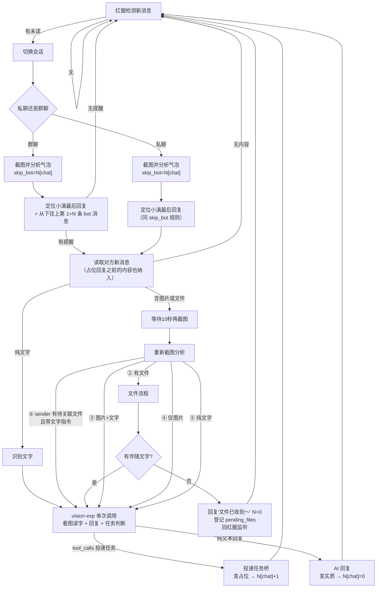

# 🐟 小漓（Xiaoli）— 微信 AI 机器人 · 视觉版

小漓是一个运行在 Windows 上的微信 AI 机器人桌面应用：自动回复微信消息（聊天/提问）、识别图片与文件，并把复杂任务投递给 AI 代理（天枢 CLI）处理，处理完成后自动把成果文件回传微信。

> **v2.1.3「OCR单片修复」** · 适配微信 PC **4.x** · 弃用 wxauto4（其 UIA 通道在新版微信 4.1.12 结构性失效），全面迁移到 **OCR 视觉方案**（PrintWindow 截图 + RapidOCR + 像素检测），4.x 全版本可用。

---

## ⬇️ 下载安装（桌面版）

**v2.1.3 完整桌面版安装包**（PySide6 图形界面 + 12 套主题 + 壁纸库 + 托盘常驻）：

👉 [点击下载 `xiaoli-setup-v2.1.3.exe`](https://github.com/wens6515/weixin-wechat-wxauto-ocr-xiaoli/releases/download/v2.1.3/xiaoli-setup-v2.1.3.exe)

> 想下载旧版本？前往 [Releases 页面](https://github.com/wens6515/weixin-wechat-wxauto-ocr-xiaoli/releases) 查看 v2.1.0 / v2.0.0 / v1.x 等所有历史版本与更新记录。

- **系统要求**：Windows 10+、已登录的**微信 PC 4.x**（4.x 版本均可）；**微信主界面需放置在屏幕右半边**（视觉方案依赖窗口位置）
- **无需安装 Python / Node.js**：安装包已内置 Python 运行时和全部依赖（含 OCR 引擎）；Node.js（天枢 CLI 依赖）在安装时自动检测，缺失则自动下载安装
- **安装**：双击安装（免管理员权限），完成后从开始菜单/桌面启动小漓
- **首次启动**：按引导配置三样东西——任务工作目录、微信文件接收目录、模型 API Key

> 安装包为桌面完整版；本仓库另提供**后端核心源码**（见下方「源码运行」）。

## 功能一览

- **微信自动回复**：监听微信消息，用 LLM（默认 DeepSeek）生成回复；私聊/群聊语境区分，群聊仅响应 `@小漓`
- **图片识别**：收到图片自动调用视觉模型（默认智谱 GLM-4V）详细描述内容
- **文件消息处理**：定位微信接收目录中的文件并处理（Word/Excel 等提取文字）
- **任务桥**：识别任务型请求（如"根据文档做一个网站"）→ 投递到任务目录 → 唤起天枢 CLI 处理 → 轮询回传文本 + 成果文件 → 自动归档
- **对话记忆**：多聊天历史持久化（memory.json）
- **未读红圈驱动**：列表区像素检测未读角标，只处理有新消息的会话——等效 wxauto4 的"新消息→处理"事件语义
- **变化检测先行**：截图后本地像素差异检测（毫秒级），无变化跳过识别，不每轮调视觉 API

## 快速上手（桌面版）

| 场景 | 做法 |
|---|---|
| 聊天/提问 | 直接给小漓发微信消息，AI 自动回复；群聊里 `@小漓` 并说内容即可 |
| 识别图片 | 直接发图片，小漓用视觉模型描述内容 |
| 处理文件 | 先发文件，再发一句指令（如"根据这个文档做一个网站"） |
| 查看结果 | 处理完成后，小漓把成果文件 + 文字说明发回微信，并归档到任务目录的 `sent/` 文件夹 |
| 暂停/恢复 | 托盘图标或命令行输入 `pause` / `resume` |

## 消息处理主循环（技术）



> 气泡/媒体分析无法区分视频、表情、图片，统一按图片处理；图片消息含文字时 10 秒等待防话没说完；文件消息「回复收到 + 不停摆」，该发送者后续文字指令自动关联待处理文件。

## 源码运行（开发者）

**前置**：Windows 10+、Python 3.12、已登录的**微信 PC 4.x**（4.x 版本均可；新版微信 4.1.12 的 UIA 通道失效，本方案已迁移 OCR 视觉通道）；**微信主界面需放置在屏幕右半边**

```bash
# 1. 创建虚拟环境并安装依赖
cd xiaoli_desktop
python -m venv .venv
.venv\Scripts\pip install -r requirements.txt

# 2. 首次使用：圈选 OCR 区域（列表区/消息区/标题区）
python tools\pick_ocr_region.py        # 图形框选，结果写入 wx_ocr_region.json

# 3. （可选）固定微信窗口位置尺寸——视觉坐标依赖窗口稳定
python tools\fix_window.py 50 50 900 920

# 4. 启动（CLI 模式，交互式控制台）
.venv\Scripts\python xiaoli_bot.py --run

# 5. 自检（不连微信，验证环境与核心逻辑）
.venv\Scripts\python xiaoli_bot.py --test
```

> 首次运行生成 `config.json`（含 `ai_api_key`，已被 .gitignore 排除，不会提交）。

## 架构

```
xiaoli_desktop/
├── xiaoli_bot.py            # CLI 入口 + 任务桥 + 消息主循环（--run / --test）
├── wechat_bot.py            # 基础微信机器人（监听/回复/图片/文件/记忆）
├── wx_backend/              # 微信后端协议层（v2.1.0 核心）
│   ├── __init__.py          # 后端注册表 + create_backend("auto")
│   ├── models.py            # WeChatMessage / MessageType
│   └── visual_backend.py    # 视觉后端：截图/OCR/红圈检测/气泡定位/发送
├── xiaoli_app/
│   └── config_store.py      # 配置加载/迁移 + 模型清单 + 人设默认（后端共用）
├── tests/                   # unittest 测试套件（后端 10 个测试文件）
├── wx_ocr_region.json       # OCR 三区域标定（pick_ocr_region 生成）
├── wx_window.json           # 微信窗口固定配置（fix_window 生成）
└── requirements.txt         # Python 3.12 依赖
tools/                       # 配套标定/调试工具
├── pick_ocr_region.py       # OCR 区域图形框选（列表→消息→标题）
├── fix_window.py            # 微信窗口位置固定
├── calibrate_input_box.py   # 输入框坐标标定
├── test_read_messages.py    # 消息读取链路调试
└── cdp_probe.py             # CDP/accessibility 通道验证探针
```

## 配置说明（config.json）

首次运行自动生成，字段含义：

| 字段 | 默认值 | 说明 |
|---|---|---|
| `ai_api_url` | `https://api.deepseek.com/v1/chat/completions` | 聊天 LLM 接口（OpenAI 兼容） |
| `ai_api_key` | 空 | **API Key（勿提交）** |
| `chat_model` | `deepseek:deepseek-v4-flash` | 聊天模型（`provider:model` 格式） |
| `system_prompt` | 通用人设 | 小漓人设（发布版不含个人信息，可自定义） |
| `bot_nickname` | 小漓 | 机器人昵称 |
| `tasks_dir` | `%USERPROFILE%\小漓\wxauto` | 任务桥工作目录 |
| `tianshu_window_title` | 空 | 天枢 CLI 窗口标题（空 = 启动时交互选择） |
| `tianshu_trigger_command` | `开始处理` | 唤起天枢后发送的触发指令 |
| `tianshu_poll_interval` | 5 | 任务结果轮询间隔（秒） |
| `file_send_method` | `clipboard` | 成果文件发送方式：clipboard（剪贴板，v2.1.0 唯一方式） |
| `max_history` | 1000 | 单聊天保留的最大历史条数 |
| `cooldown` | 3 | 回复冷却（秒） |
| `start_paused` | true | 启动时是否暂停自动回复 |

控制台可用命令：`pause` / `resume` / `model [名称]` / `chat-temp <0~2>` / `chat-top-p <0~1>` / `vision-temp <0~2>` / `tianshu-window` / `task-status` / `clear [聊天ID]` / `del <聊天ID> <序号...>` / `memory <聊天ID>` / `status` / `quit` / `help`

## 隐私与安全

- `config.json`（含 API Key，DPAPI 加密落盘）、`cards/`（角色卡）、`memory.json`、`processed_ids.json`、`dist/`、`.rivet/` 均被 .gitignore 排除，不会进入版本库
- 源码默认 system_prompt 为通用人设，不含真实姓名/学校/群组信息
- API Key 在界面显示时自动遮蔽（`sk-***1234`）

## 技术说明与已知边界

- **视觉通道唯一**：微信 4.1.12+ 关闭了 UIA/CDP/窗口消息/本地数据读取等全部高效通道（验证过程见 `docs/微信通道验证结论.md`），PrintWindow 截图 + OCR 是唯一可用通道
- **窗口稳定性**：视觉坐标依赖微信窗口位置/尺寸稳定，拖动窗口后需重新固定（`tools/fix_window.py`）或重新圈选 OCR 区域
- **群聊判定**：以标题区 OCR（括号人数）为权威信号，群名不含"群/集团"且无人数时可能漏判
- 中文发送走剪贴板；图片/表情/视频统一按图片走多模态识别

## 更新记录

- [v2.1.3 完整更新记录](https://github.com/wens6515/weixin-wechat-wxauto-ocr-xiaoli/blob/main/docs/更新记录-2026-08-24.md)（消息区 OCR 单片修复/切字碎片根治/视觉时间注入/群聊重复点击/清空记忆/回复前缀）
- [v2.1.2 完整更新记录](https://github.com/wens6515/weixin-wechat-wxauto-ocr-xiaoli/blob/main/docs/更新记录-2026-08-23-3.md)（聊天记忆注入历史+时间戳/vision 预算裁剪）
- [v2.1.1 完整更新记录](https://github.com/wens6515/weixin-wechat-wxauto-ocr-xiaoli/blob/main/docs/更新记录-2026-08-23-2.md)（模型配置页修复/角色卡中文名/动画 600ms）
- [v2.1.0 完整更新记录](https://github.com/wens6515/weixin-wechat-wxauto-ocr-xiaoli/blob/main/docs/更新记录-2026-08-23.md)（单模型化/人设修复/sender 修复）
- [v2.0.0 完整更新记录](https://github.com/wens6515/weixin-wechat-wxauto-ocr-xiaoli/blob/main/docs/更新记录-2026-08-17.md)（视觉版发布：OCR 视觉方案迁移）
- [v1.0.1 完整更新记录](https://github.com/wens6515/weixin-wechat-wxauto-ocr-xiaoli/blob/main/docs/更新记录-2026-08-06.md)（纯文字任务不带附件/DPAPI 加密/命令注册表）
- [v1.0.0「初漓」先行测试版](https://github.com/wens6515/weixin-wechat-wxauto-ocr-xiaoli/releases/tag/v1.0.0)（最早版本，无独立更新记录）
