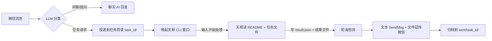

# 🐟 小漓（Xiaoli）— 微信 AI 机器人桌面版

小漓是一个运行在 Windows 上的微信 AI 机器人桌面应用：自动回复微信消息（聊天/提问）、识别图片与文件，并把复杂任务投递给 AI 代理（天枢 CLI）处理，处理完成后自动把成果文件回传微信。自带 PySide6 图形界面（托盘常驻）与一键安装包。

> 版本：v1.0.1「初漓」· 状态：先行测试版（个人工具，按需迭代，欢迎反馈）

---

## 功能一览

- **微信自动回复**：监听微信消息，用 LLM（默认 DeepSeek）生成回复；私聊/群聊语境区分
- **图片识别**：收到图片自动调用视觉模型（默认智谱 GLM-4V）详细描述内容
- **文件消息处理**：定位微信接收目录中的文件并处理
- **任务桥**：识别任务型请求（如"根据文档做一个网站"）→ 投递到任务目录 → 唤起天枢 CLI 处理 → 轮询回传文本 + 成果文件 → 自动归档
- **对话记忆**：多聊天历史持久化（memory.json），支持删除/清空单条消息
- **图形界面**：PySide6 主窗口 + 系统托盘常驻；首次启动引导配置工作目录、模型与天枢 CLI
- **免管理员安装包**：Inno Setup 打包，安装时自动检测/安装 Node.js（天枢 CLI 依赖）

## 快速开始

### 方式一：安装包（推荐给普通用户）

1. 从 [Releases](https://github.com/wens6515/xiaoli/releases) 下载 `xiaoli-setup-v1.0.1.exe`
2. 双击安装（无需管理员权限，安装到 `%LOCALAPPDATA%\Programs\小漓`）
3. 安装程序会自动检查 Node.js——缺失时自动下载官方 LTS 并静默安装（per-user），随后自动安装天枢 CLI（`npm install -g tianshu-tui`）
4. 首次启动按引导选择三个目录：任务工作目录、微信文件接收目录、天枢 CLI 工作目录，并配置模型 API Key

### 方式二：源码运行（开发/自建）

前置：Windows 10+、Python 3.12、已登录的微信 PC 版、Node.js（天枢 CLI 依赖）

```bash
# 1. 创建虚拟环境并安装依赖
cd xiaoli_desktop
python -m venv .venv
.venv\Scripts\pip install -r requirements.txt

# 2. 启动 GUI（推荐）
.venv\Scripts\pythonw xiaoli_gui.py

# 3. 或命令行模式（无 GUI，交互式控制台）
.venv\Scripts\python xiaoli_bot.py --run

# 4. 自检（不连微信，验证环境与核心逻辑）
.venv\Scripts\python xiaoli_bot.py --test
```

> 首次运行会生成 `config.json`（含 `ai_api_key`，已被 .gitignore 排除，不会提交）。天枢 CLI 首次配置：首次启动引导会自动执行 `npm install -g tianshu-tui` 并带你完成模型/API Key 配置。

## 使用说明

### 安装后第一次启动

1. 双击 `xiaoli-setup-v1.0.1.exe` 安装（免管理员权限），完成后从开始菜单/桌面启动小漓
2. 首次启动会自动检查 Node.js 与天枢 CLI，缺失时自动下载安装（首次约几分钟，日志在 `%TEMP%\xiaoli-install-node.log`）
3. 按引导配置三样东西：
   - **任务工作目录**：AI 代理处理任务时的工作文件夹（建议建个专门的文件夹，如 `D:\工作间\wxauto`）
   - **微信文件接收目录**：微信 PC 版接收文件的文件夹（在微信设置 → 文件管理里可查到）
   - **模型 API Key**：聊天用 DeepSeek、看图用智谱 GLM，在对应平台官网注册获取后填入

配置完成后，小漓会常驻系统托盘，收到微信消息自动回复。

### 日常怎么用

| 场景 | 做法 |
|---|---|
| 聊天/提问 | 直接给小漓发微信消息，AI 自动回复；群聊里 @小漓 并说内容即可 |
| 识别图片 | 直接发图片，小漓会用视觉模型描述图片内容 |
| 处理文件 | 先发文件，再发一句指令（如"根据这个文档做一个网站"），任务会自动投递给 AI 代理处理 |
| 查看结果 | 处理完成后，小漓会把成果文件 + 文字说明发回微信，并归档到任务目录的 `sent/` 文件夹 |
| 暂停/恢复 | 托盘图标或命令行输入 `pause` / `resume`；默认启动时暂停（防误回），需要时手动恢复 |

### 常见问题

- **发消息没回复？** 小漓默认启动时暂停自动回复——在托盘菜单或命令行输入 `resume` 恢复；另外每条消息后有 3 秒冷却，避免连发刷屏
- **API Key 填错了/想换模型？** 界面设置里可改；命令行用 `model 模型名` / `vision-model 模型名`
- **换电脑或重装系统后要重新填 Key？** 是的——API Key 用 Windows 加密存储，换机器解不开，需重新填写（这是安全设计）
- **为什么纯文字任务不带我上次发的文件？** v1.0.1 起，纯文字消息不再自动附带微信文件，需要 AI 处理文件时请先发文件再发指令
- **图形界面和命令行能同时开吗？** 不能，小漓同一时间只允许一个实例运行，避免抢微信窗口/重复发消息

## 架构

```
xiaoli_desktop/
├── xiaoli_gui.py          # GUI 入口（PySide6，无终端；托盘常驻）
├── xiaoli_bot.py          # 合并版 bot：聊天 + 天枢任务桥（自检入口 --test）
├── wechat_bot.py          # 基础微信机器人（监听/回复/图片/文件/记忆）
├── xiaoli_app/
│   ├── config_store.py    # 配置加载/迁移/投影 + 角色卡管理（卡片模板不含个人信息）
│   ├── card_store.py      # 角色卡读写（cards/，运行时生成）
│   ├── engine.py          # 引擎线程 + 事件总线（GUI 与 bot 解耦）
│   ├── setup.py           # 首次启动引导：目录选择、天枢 CLI 检测/自动安装/配置
│   └── ui/                # PySide6 界面（main_window / pages / tray）
├── tests/                 # unittest 测试套件（168 用例）
└── requirements.txt       # Python 3.12 依赖
```

### 任务桥数据流



## 配置说明（config.json）

首次运行自动生成，字段含义：

| 字段 | 默认值 | 说明 |
|---|---|---|
| `ai_api_url` | `https://api.deepseek.com/v1/chat/completions` | 聊天 LLM 接口（OpenAI 兼容） |
| `ai_api_key` | 空 | **API Key（勿提交）** |
| `chat_model` | `deepseek:deepseek-v4-flash` | 聊天模型（`provider:model` 格式） |
| `vision_model` | `zhipu:glm-4.6v` | 视觉模型 |
| `system_prompt` | 通用人设 | 小漓人设（发布版不含个人信息，可自定义） |
| `bot_nickname` | 小漓 | 机器人昵称 |
| `tasks_dir` | `D:\工作间\wxauto` | 任务桥工作目录 |
| `tianshu_window_title` | 空 | 天枢 CLI 窗口标题（空 = 启动时交互选择） |
| `tianshu_trigger_command` | `开始处理` | 唤起天枢后发送的触发指令 |
| `tianshu_poll_interval` | 5 | 任务结果轮询间隔（秒） |
| `file_send_method` | `clipboard` | 成果文件发送方式：clipboard（剪贴板，主用）/ wxauto（兜底） |
| `max_history` | 1000 | 单聊天保留的最大历史条数 |
| `cooldown` | 3 | 回复冷却（秒） |
| `start_paused` | true | 启动时是否暂停自动回复 |

控制台（命令行模式）可用命令：`pause` / `resume` / `model [名称]` / `vision-model [名称]` / `chat-temp <0~2>` / `chat-top-p <0~1>` / `vision-temp <0~2>` / `tianshu-window` / `task-status` / `clear [聊天ID]` / `del <聊天ID> <序号...>` / `memory <聊天ID>` / `status` / `quit` / `help`

## 隐私与安全

- `config.json`（含 API Key）、`cards/`（角色卡，含人格设定）、`memory.json`、`processed_ids.json`、`dist/`、`.rivet/` 均被 .gitignore 排除，不会进入版本库
- 源码默认 system_prompt 为通用人设，不含真实姓名/学校/群组信息（旧版本含个人信息的配置在迁移时会被清除，见 `tests/test_config_store.py` 隐私测试）
- API Key 在界面显示时自动遮蔽（`sk-***1234`）

## 技术栈

Python 3.12 · wxauto4（微信自动化）· uiautomation / PyAutoGUI / pywin32（UI 自动化）· PySide6（GUI）· requests（LLM API）· PyInstaller（打包）· Inno Setup（安装包）

## License

[MIT](LICENSE)
