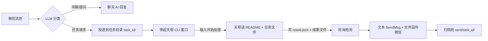

# 🐟 小漓（Xiaoli）— 微信 AI 机器人桌面版

小漓是一个运行在 Windows 上的微信 AI 机器人桌面应用：自动回复微信消息（聊天/提问）、识别图片与文件，并把复杂任务投递给 AI 代理（天枢 CLI）处理，处理完成后自动把成果文件回传微信。自带 PySide6 图形界面（托盘常驻）与一键安装包。

> 版本：v1.0.0「初漓」· 状态：可用（个人工具，按需迭代）

---

## 功能一览

- **微信自动回复**：监听微信消息，用 LLM（默认 DeepSeek）生成回复；私聊/群聊语境区分
- **图片识别**：收到图片自动调用视觉模型（默认智谱 GLM-4V）详细描述内容
- **文件消息处理**：定位微信接收目录中的文件并处理
- **任务桥**：识别任务型请求（如"根据文档做一个网站"）→ 投递到任务目录 → 唤起天枢 CLI 处理 → 轮询回传文本 + 成果文件 → 自动归档
- **对话记忆**：多聊天历史持久化（memory.json），支持删除/清空单条消息
- **图形界面**：PySide6 主窗口 + 系统托盘常驻；首次启动引导配置工作目录、模型与天枢 CLI
- **免管理员安装包**：Inno Setup 打包，安装时自动检测/安装 Node.js（天枢 CLI 依赖）

## 快速开始

### 方式一：安装包（推荐给普通用户）

1. 从 [Releases](https://github.com/wens6515/xiaoli/releases) 下载 `xiaoli-setup-v1.0.0.exe`
2. 双击安装（无需管理员权限，安装到 `%LOCALAPPDATA%\Programs\小漓`）
3. 安装程序会自动检查 Node.js——缺失时自动下载官方 LTS 并静默安装（per-user），随后自动安装天枢 CLI（`npm install -g tianshu-tui`）
4. 首次启动按引导选择三个目录：任务工作目录、微信文件接收目录、天枢 CLI 工作目录，并配置模型 API Key

### 方式二：源码运行（开发/自建）

前置：Windows 10+、Python 3.12、已登录的微信 PC 版、Node.js（天枢 CLI 依赖）

```bash
# 1. 创建虚拟环境并安装依赖
cd xiaoli_desktop
python -m venv .venv
.venv\Scripts\pip install -r requirements.txt

# 2. 启动 GUI（推荐）
.venv\Scripts\pythonw xiaoli_gui.py

# 3. 或命令行模式（无 GUI，交互式控制台）
.venv\Scripts\python xiaoli_bot.py --run

# 4. 自检（不连微信，验证环境与核心逻辑）
.venv\Scripts\python xiaoli_bot.py --test
```

> 首次运行会生成 `config.json`（含 `ai_api_key`，已被 .gitignore 排除，不会提交）。天枢 CLI 首次配置：首次启动引导会自动执行 `npm install -g tianshu-tui` 并带你完成模型/API Key 配置。

## 架构

```
xiaoli_desktop/
├── xiaoli_gui.py          # GUI 入口（PySide6，无终端；托盘常驻）
├── xiaoli_bot.py          # 合并版 bot：聊天 + 天枢任务桥（自检入口 --test）
├── wechat_bot.py          # 基础微信机器人（监听/回复/图片/文件/记忆）
├── xiaoli_app/
│   ├── config_store.py    # 配置加载/迁移/投影 + 角色卡管理（卡片模板不含个人信息）
│   ├── card_store.py      # 角色卡读写（cards/，运行时生成）
│   ├── engine.py          # 引擎线程 + 事件总线（GUI 与 bot 解耦）
│   ├── setup.py           # 首次启动引导：目录选择、天枢 CLI 检测/自动安装/配置
│   └── ui/                # PySide6 界面（main_window / pages / tray）
├── tests/                 # unittest 测试套件（168 用例）
└── requirements.txt       # Python 3.12 依赖
```

### 任务桥数据流



## 配置说明（config.json）

首次运行自动生成，字段含义：

| 字段 | 默认值 | 说明 |
|---|---|---|
| `ai_api_url` | `https://api.deepseek.com/v1/chat/completions` | 聊天 LLM 接口（OpenAI 兼容） |
| `ai_api_key` | 空 | **API Key（勿提交）** |
| `chat_model` | `deepseek:deepseek-v4-flash` | 聊天模型（`provider:model` 格式） |
| `vision_model` | `zhipu:glm-4.6v` | 视觉模型 |
| `system_prompt` | 通用人设 | 小漓人设（发布版不含个人信息，可自定义） |
| `bot_nickname` | 小漓 | 机器人昵称 |
| `tasks_dir` | `D:\工作间\wxauto` | 任务桥工作目录 |
| `tianshu_window_title` | 空 | 天枢 CLI 窗口标题（空 = 启动时交互选择） |
| `tianshu_trigger_command` | `开始处理` | 唤起天枢后发送的触发指令 |
| `tianshu_poll_interval` | 5 | 任务结果轮询间隔（秒） |
| `file_send_method` | `clipboard` | 成果文件发送方式：clipboard（剪贴板，主用）/ wxauto（兜底） |
| `max_history` | 1000 | 单聊天保留的最大历史条数 |
| `cooldown` | 3 | 回复冷却（秒） |
| `start_paused` | true | 启动时是否暂停自动回复 |

控制台（命令行模式）可用命令：`pause` / `resume` / `model [名称]` / `vision-model [名称]` / `chat-temp <0~2>` / `chat-top-p <0~1>` / `vision-temp <0~2>` / `tianshu-window` / `task-status` / `clear [聊天ID]` / `del <聊天ID> <序号...>` / `memory <聊天ID>` / `status` / `quit` / `help`

## 测试

```bash
cd xiaoli_desktop
.venv\Scripts\python -m unittest discover -s tests -p "test_*.py"   # 168 用例
.venv\Scripts\python xiaoli_bot.py --test                            # bot 自检（58 项）
```

## 打包发布

```bash
# 1. PyInstaller 打包（onedir，产物 dist\小漓\）
.venv\Scripts\pyinstaller 小漓.spec

# 2. Inno Setup 生成安装包（需要 Inno Setup 6，含 Node.js 自动安装逻辑）
"C:\...\ISCC.exe" dist\小漓.iss
# 产物：dist\小漓安装包.exe

# 3. 发布到 GitHub Releases
gh release create v1.0.0 dist/小漓安装包.exe --title "小漓 v1.0.0" --notes "..."
```

安装包内置 `tools\install-node.ps1`：检测 `node` 命令，缺失时从 nodejs.org 下载最新 LTS 并 per-user 静默安装（免管理员），随后自动 `npm install -g tianshu-tui`，并持久化 PATH。日志在 `%TEMP%\xiaoli-install-node.log`。

## 隐私与安全

- `config.json`（含 API Key）、`cards/`（角色卡，含人格设定）、`memory.json`、`processed_ids.json`、`dist/`、`.rivet/` 均被 .gitignore 排除，不会进入版本库
- 源码默认 system_prompt 为通用人设，不含真实姓名/学校/群组信息（旧版本含个人信息的配置在迁移时会被清除，见 `tests/test_config_store.py` 隐私测试）
- API Key 在界面显示时自动遮蔽（`sk-***1234`）

## 技术栈

Python 3.12 · wxauto4（微信自动化）· uiautomation / PyAutoGUI / pywin32（UI 自动化）· PySide6（GUI）· requests（LLM API）· PyInstaller（打包）· Inno Setup（安装包）

## License

[MIT](LICENSE)
