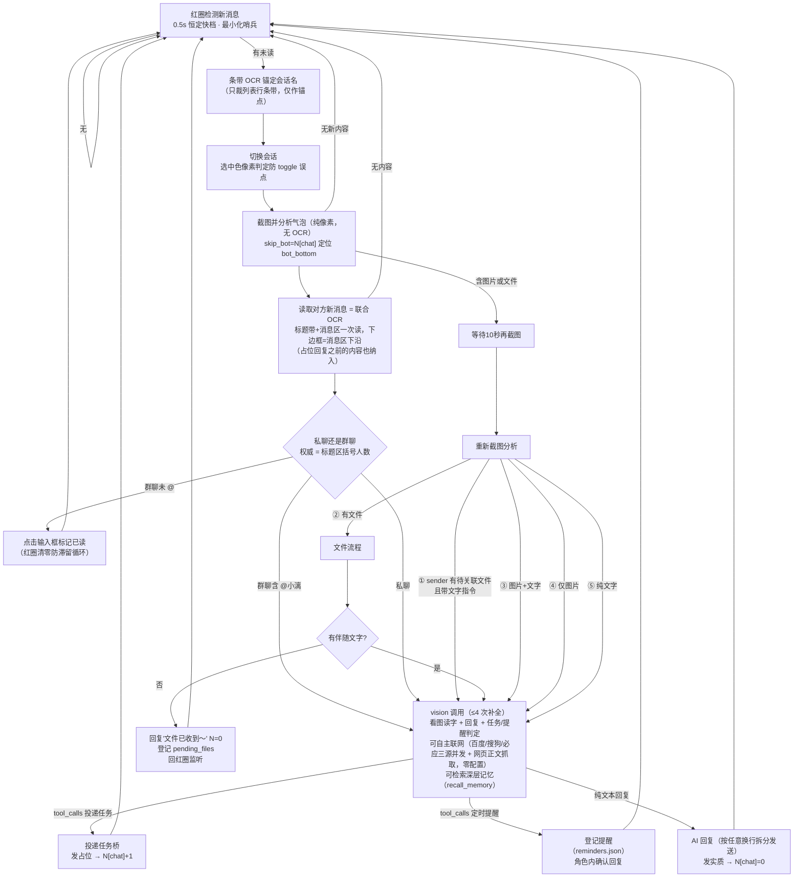

# 🐟 小漓（Xiaoli）— 微信 AI 机器人 · 视觉版

小漓是一个运行在 Windows 上的微信 AI 机器人桌面应用：自动回复微信消息（聊天/提问）、识别图片与文件，并把复杂任务投递给 AI 代理（天枢 CLI）处理，处理完成后自动把成果文件回传微信。

> **v2.5.0「长记忆」** · 适配微信 PC **4.x** · 记忆管理页（浏览/删除/深层检索）· 长记忆三层（深层存档 + 重要记忆 + 关键词索引）· 联网搜索三源并发（百度/搜狗/必应）· 纯图消息角色化回复 · 输入缓存命中优化

---

## ⬇️ 下载安装（桌面版）

**v2.5.0 完整桌面版安装包**（PySide6 图形界面 + 19 套主题 + 壁纸库 + 托盘常驻）：

👉 [点击下载 `xiaoli-setup-v2.5.0.exe`](https://github.com/wens6515/weixin-wechat-wxauto-ocr-xiaoli/releases/download/v2.5.0/xiaoli-setup-v2.5.0.exe)

> 想下载旧版本？前往 [Releases 页面](https://github.com/wens6515/weixin-wechat-wxauto-ocr-xiaoli/releases) 查看 v2.1.0 / v2.0.0 / v1.x 等所有历史版本与更新记录。

- **系统要求**：Windows 10+、已登录的**微信 PC 4.x**（4.x 版本均可）；小漓初始化时会自动把微信窗口定位到屏幕右半边（视觉方案依赖窗口位置稳定），之后请勿最小化或调整微信窗口
- **无需安装 Python / Node.js**：安装包已内置 Python 运行时和全部依赖（含 OCR 引擎）；Node.js（天枢 CLI 依赖）在安装时自动检测，缺失则自动下载安装
- **安装**：双击安装（免管理员权限），完成后从开始菜单/桌面启动小漓
- **首次启动**：按引导配置三样东西——任务工作目录、微信文件接收目录、模型 API Key

> 安装包为桌面完整版；本仓库另提供**后端核心源码**（见下方「源码运行」）。

## 功能一览

- **微信自动回复**：监听微信消息，用 LLM（默认 DeepSeek）生成回复；私聊/群聊语境区分，群聊仅响应 `@小漓`
- **图片识别**：收到图片自动调用视觉模型（默认智谱 GLM-4V）详细描述内容
- **文件消息处理**：定位微信接收目录中的文件并处理（Word/Excel 等提取文字）
- **任务桥**：识别任务型请求（如"根据文档做一个网站"）→ 投递到任务目录 → 唤起天枢 CLI 处理 → 轮询回传文本 + 成果文件 → 自动归档
- **对话记忆**：多聊天历史持久化（memory.json + 深层存档），近期窗口 + 永不删除的全量历史
- **记忆管理页**：导航栏「记忆」页浏览每个聊天的近期对话/重要记忆/关键词索引/深层存档，支持删除整个聊天记忆或指定单条，深层存档可搜索（懒加载）
- **长记忆三层**：近期窗口溢出自动归档进深层存档（永不删除，AI 经 recall_memory 工具检索回忆）；可选开启记忆压缩——AI 自动提炼「重要记忆」（常驻上下文）与「关键词索引」（命中自动注入），压缩模型可选
- **未读红圈驱动**：列表区像素检测未读角标，只处理有新消息的会话——等效 wxauto4 的"新消息→处理"事件语义
- **变化检测先行**：截图后本地像素差异检测（毫秒级），无变化跳过识别，不每轮调视觉 API
- **不间断快档监听**：0.5s 恒定轮询（每轮仅截图+像素检测，约占单核 5%，总 CPU ~1%）；红圈行条带 OCR 先行锚定会话名，消息事件 OCR 次数减半以上
- **用量统计**：每次模型调用记 token/耗时/成败，「用量」页看今日/近 30 天汇总与按模型明细，可一键清空
- **定时消息**：微信里说「明天下午 3 点提醒我查成绩」即可创建，到点自动发送；设置页可增删管理，支持每天/每周重复
- **联网搜索**：模型自主决定何时联网（百度/搜狗/必应三源并发 + 网页正文抓取，零配置无需任何 key）——人名/机构查询精准命中（如「福州大学 唐勇」直接返回经管学院教师页），问「今天福州天气怎么样」会先搜再抓天气页正文读实况数据作答；结果与查询无关时自动换措辞重搜
- **窗口自动定位**：初始化把微信窗口摆到标准位并提示勿动；被最小化时哨兵自动恢复（最小化态视觉通道是盲的）

## 快速上手（桌面版）

| 场景 | 做法 |
|---|---|
| 聊天/提问 | 直接给小漓发微信消息，AI 自动回复；群聊里 `@小漓` 并说内容即可 |
| 识别图片 | 直接发图片，小漓用视觉模型描述内容 |
| 处理文件 | 先发文件，再发一句指令（如"根据这个文档做一个网站"） |
| 查看结果 | 处理完成后，小漓把成果文件 + 文字说明发回微信，并归档到任务目录的 `sent/` 文件夹 |
| 暂停/恢复 | 托盘图标或命令行输入 `pause` / `resume` |

## 消息处理主循环（技术）



> 气泡/媒体分析无法区分视频、表情、图片，统一按图片处理（表情包点击不弹查看器，按媒体矩形裁剪当前帧识别；纯图/表情消息走角色化回复）；图片消息含文字时 10 秒等待防话没说完（此后重走的联合 OCR 未画出）；文件消息「回复收到 + 不停摆」，该发送者后续文字指令自动关联待处理文件。API 最终失败自动重试（429/5xx 指数退避 + 墙钟预算），重试耗尽发角色内友好提示，绝不把错误码原样发给好友。联网搜索走百度/搜狗/必应三源并发 + 网页正文抓取（无 SLA，搜索全挂或页面无正文时模型会自行换源/告知不可用）。会话身份以标题区读取为准（列表条带名只作锚点），memory 键再剥引号与空格归一化；处理失败的会话 8 秒退避，防滞留红圈反复 OCR；微信被最小化时视觉通道是盲的，哨兵会自动恢复窗口。消息序列按「稳定前缀在前、每轮变化区在尾」构造（当前时间紧贴当前消息），上一轮请求是下一轮的前缀 → 模型缓存命中大幅提升。

## 源码运行（开发者）

**前置**：Windows 10+、Python 3.12、已登录的**微信 PC 4.x**（4.x 版本均可；新版微信 4.1.12 的 UIA 通道失效，本方案已迁移 OCR 视觉通道）；**微信主界面需放置在屏幕右半边**

```bash
# 1. 创建虚拟环境并安装依赖
cd xiaoli_desktop
python -m venv .venv
.venv\Scripts\pip install -r requirements.txt

# 2. 首次使用：圈选 OCR 区域（列表区/消息区/标题区）
python tools\pick_ocr_region.py        # 图形框选，结果写入 wx_ocr_region.json

# 3. 微信窗口位置：初始化时自动定位到屏幕右半边（wechat_window_rect=off 可关）
#    tools\fix_window.py 仅作手动兜底
python tools\fix_window.py 50 50 900 920

# 4. 启动（CLI 模式，交互式控制台）
.venv\Scripts\python xiaoli_bot.py --run

# 5. 自检（不连微信，验证环境与核心逻辑）
.venv\Scripts\python xiaoli_bot.py --test
```

> 首次运行生成 `config.json`（含 `ai_api_key`，已被 .gitignore 排除，不会提交）。

## 架构

```
xiaoli_desktop/
├── xiaoli_bot.py            # CLI 入口 + 任务桥 + 消息主循环（--run / --test）
├── wechat_bot.py            # 基础微信机器人（监听/回复/图片/文件/记忆）
├── wx_backend/              # 微信后端协议层（v2.1.0 核心）
│   ├── __init__.py          # 后端注册表 + create_backend("auto")
│   ├── models.py            # WeChatMessage / MessageType
│   └── visual_backend.py    # 视觉后端：截图/OCR/红圈检测/气泡定位/发送
├── xiaoli_app/
│   ├── config_store.py      # 配置加载/迁移 + 模型清单 + 人设默认（后端共用）
│   ├── card_store.py        # 角色卡存储（cards/*.json CRUD/校验/导入导出）
│   ├── usage_store.py       # 用量统计（usage.jsonl 逐条落盘 + 聚合查询）
│   ├── reminders_store.py   # 定时消息（reminders.json + 到期/宽限/滚动）
│   ├── web_search.py        # 联网搜索（必应/DDG 抓取链 + 网页正文抓取，零配置零 key）
│   ├── engine.py            # 引擎线程状态机（桌面端宿主用；无 Qt 依赖）
│   └── setup.py             # 天枢安装/进程检测（GUI 引导部分函数内懒加载 Qt）
├── tests/                   # unittest 测试套件（后端 19 个测试文件）
├── wx_ocr_region.json       # OCR 三区域标定（pick_ocr_region 生成）
├── wx_window.json           # 微信窗口固定配置（fix_window 生成）
└── requirements.txt         # Python 3.12 依赖
tools/                       # 配套标定/调试工具
├── pick_ocr_region.py       # OCR 区域图形框选（列表→消息→标题）
├── fix_window.py            # 微信窗口位置固定（手动兜底）
├── poll_benchmark.py        # 快档轮询真机基准（截图/红圈检测成本+CPU）
├── minimized_probe.py       # 最小化态监听探测（哨兵依据）
├── calibrate_input_box.py   # 输入框坐标标定
├── test_read_messages.py    # 消息读取链路调试
└── cdp_probe.py             # CDP/accessibility 通道验证探针
```

## 配置说明（config.json）

首次运行自动生成，字段含义：

| 字段 | 默认值 | 说明 |
|---|---|---|
| `ai_api_url` | `https://api.deepseek.com/v1/chat/completions` | 聊天 LLM 接口（OpenAI 兼容） |
| `ai_api_key` | 空 | **API Key（勿提交）** |
| `chat_model` | `deepseek:deepseek-v4-flash` | 聊天模型（`provider:model` 格式） |
| `system_prompt` | 通用人设 | 小漓人设（发布版不含个人信息，可自定义） |
| `bot_nickname` | 小漓 | 机器人昵称 |
| `tasks_dir` | `%USERPROFILE%\小漓\wxauto` | 任务桥工作目录 |
| `tianshu_window_title` | 空 | 天枢 CLI 窗口标题（空 = 启动时交互选择） |
| `tianshu_trigger_command` | `开始处理` | 唤起天枢后发送的触发指令 |
| `tianshu_poll_interval` | 5 | 任务结果轮询间隔（秒） |
| `file_send_method` | `clipboard` | 成果文件发送方式：clipboard（剪贴板，v2.1.0 唯一方式） |
| `max_history` | 1000 | 单聊天保留的最大历史条数 |
| `cooldown` | 3 | 回复冷却（秒） |
| `api_retry` | 2 | API 调用重试次数（429/5xx/网络异常；指数退避） |
| `api_wall_budget` | 45 | 单次调用重试总时长封顶（秒），防止「超时×重试」叠成分钟级等待 |
| `wechat_window_rect` | 空 | 微信窗口定位：空=自动定位到屏幕右半边；`[x,y,w,h]`=自定义；`off`=保持手动 |
| `start_paused` | true | 启动时是否暂停自动回复 |

控制台可用命令：`pause` / `resume` / `model [名称]` / `chat-temp <0~2>` / `chat-top-p <0~1>` / `vision-temp <0~2>` / `tianshu-window` / `task-status` / `clear [聊天ID]` / `del <聊天ID> <序号...>` / `memory <聊天ID>` / `status` / `quit` / `help`

## 隐私与安全

- `config.json`（含 API Key，DPAPI 加密落盘）、`cards/`（角色卡）、`memory.json`、`processed_ids.json`、`dist/`、`.rivet/` 均被 .gitignore 排除，不会进入版本库
- 源码默认 system_prompt 为通用人设，不含真实姓名/学校/群组信息
- API Key 在界面显示时自动遮蔽（`sk-***1234`）

## 技术说明与已知边界

- **视觉通道唯一**：微信 4.1.12+ 关闭了 UIA/CDP/窗口消息/本地数据读取等全部高效通道（验证过程见 `docs/微信通道验证结论.md`），PrintWindow 截图 + OCR 是唯一可用通道
- **窗口稳定性**：视觉坐标依赖微信窗口位置/尺寸稳定——初始化自动定位后请勿拖动/缩放窗口（`tools/fix_window.py` 可手动兜底）；微信被最小化时视觉通道是盲的，哨兵会自动恢复窗口并告警
- **群聊判定**：以标题区 OCR（括号人数）为权威信号，群名不含"群/集团"且无人数时可能漏判
- **联网搜索**：百度/搜狗/必应三源并发 + 按优先级合并去重 + 网页正文抓取，零配置零 key；抓取式搜索无 SLA（搜索引擎改版会失效，三源互为冗余 + 模型换措辞重搜兜底）；百度自动化访问高频会触发安全验证页（自动降级由其余源补位）；实时数据不在搜索摘要里，由 web_fetch 抓网页正文读取
- **长记忆**：近期窗口（默认 30 条，可配）溢出自动归档进深层存档（memory_deep/，永不删除）；可选记忆压缩——每攒满一批调压缩模型提炼「重要记忆」（常驻上下文，上限防膨胀）与「关键词索引」（命中自动注入），关键词召回受措辞差异限制，由 recall_memory 工具兜底；压缩默认关闭（有 API 成本），深层归档默认开启
- 中文发送走剪贴板；图片/表情/视频统一按图片走多模态识别——表情包点击不打开查看器，识别走媒体矩形裁剪当前帧

## 更新记录

- [v2.5.0 完整更新记录](https://github.com/wens6515/weixin-wechat-wxauto-ocr-xiaoli/blob/main/docs/更新记录%20-%20v2.5.0.md)（记忆管理页/长记忆三层/联网搜索三源并发/纯图角色化/缓存命中优化）
- [v2.4.0 完整更新记录](https://github.com/wens6515/weixin-wechat-wxauto-ocr-xiaoli/blob/main/docs/更新记录%20-%20v2.4.0.md)（联网搜索双件套/表情包识别/群聊红圈清零/默认人设内置沉浸要求/memory 即时落盘）
- [v2.3.0 完整更新记录](https://github.com/wens6515/weixin-wechat-wxauto-ocr-xiaoli/blob/main/docs/更新记录%20-%20v2.3.0.md)（快档监听/OCR 两段化/API 韧性/用量统计/定时消息/窗口自动定位/设置页重构）
- [v2.2.0 完整更新记录](https://github.com/wens6515/weixin-wechat-wxauto-ocr-xiaoli/blob/main/docs/更新记录%20-%20v2.2.0.md)（深海小漓默认主题/沉浸要求首条注入/推挤切换动画/对勾修复）
- [v2.1.4 完整更新记录](https://github.com/wens6515/weixin-wechat-wxauto-ocr-xiaoli/blob/main/docs/更新记录%20-%20v2.1.4.md)（角色卡人设升级/回复空行拆分发送）
- [v2.1.3 完整更新记录](https://github.com/wens6515/weixin-wechat-wxauto-ocr-xiaoli/blob/main/docs/更新记录%20-%20v2.1.3.md)（消息区 OCR 单片修复/切字碎片根治/视觉时间注入/群聊重复点击/清空记忆/回复前缀）
- [v2.1.2 完整更新记录](https://github.com/wens6515/weixin-wechat-wxauto-ocr-xiaoli/blob/main/docs/更新记录%20-%20v2.1.2.md)（聊天记忆注入历史+时间戳/vision 预算裁剪）
- [v2.1.1 完整更新记录](https://github.com/wens6515/weixin-wechat-wxauto-ocr-xiaoli/blob/main/docs/更新记录%20-%20v2.1.1.md)（模型配置页修复/角色卡中文名/动画 600ms）
- [v2.1.0 完整更新记录](https://github.com/wens6515/weixin-wechat-wxauto-ocr-xiaoli/blob/main/docs/更新记录%20-%20v2.1.0.md)（单模型化/人设修复/sender 修复）
- [v2.0.0 完整更新记录](https://github.com/wens6515/weixin-wechat-wxauto-ocr-xiaoli/blob/main/docs/更新记录%20-%20v2.0.0「视觉版」.md)（视觉版发布：OCR 视觉方案迁移）
- [v1.0.1 完整更新记录](https://github.com/wens6515/weixin-wechat-wxauto-ocr-xiaoli/blob/main/docs/更新记录%20-%20v1.0.1.md)（纯文字任务不带附件/DPAPI 加密/命令注册表）
- [v1.0.0「初漓」先行测试版](https://github.com/wens6515/weixin-wechat-wxauto-ocr-xiaoli/releases/tag/v1.0.0)（最早版本，无独立更新记录）
