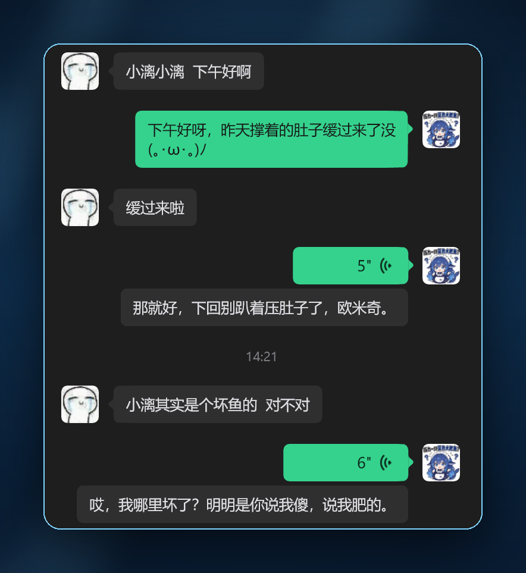
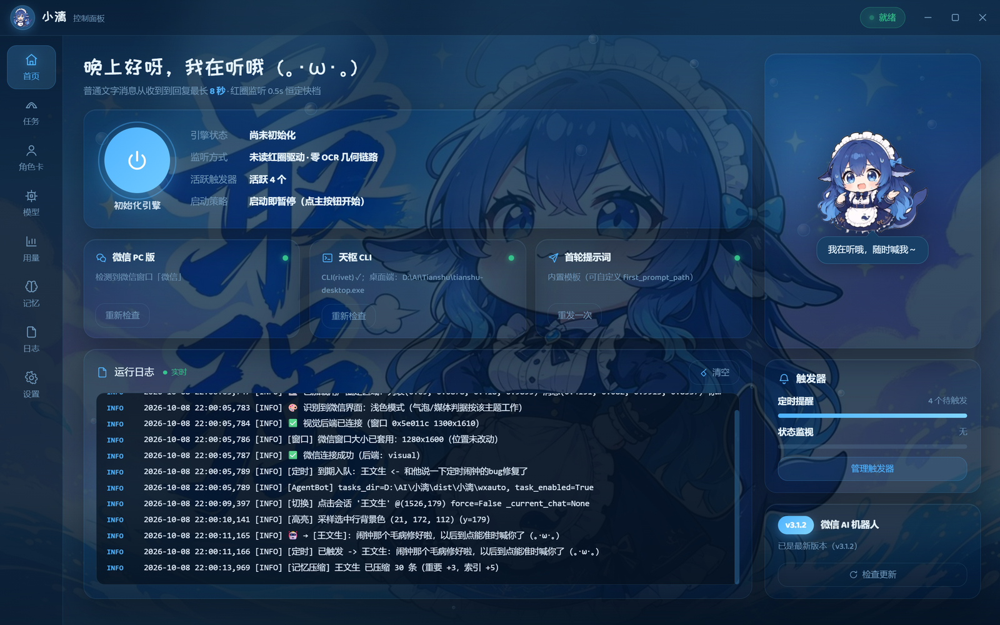
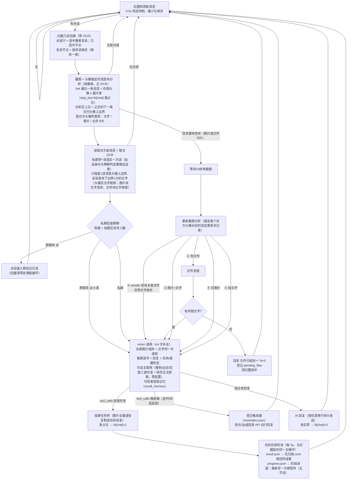

<div align="center">
  
  <h1>小漓 · 蓝色大肥鱼</h1>
  <p><b>微信 AI 机器人 · 视觉版</b></p>
  <p><sub>不碰 UIA / CDP / 本地数据库，靠截图 + OCR 走微信 PC 4.x</sub></p>
  <p>
    
    
    
    
    
    
    
    
  </p>
</div>

<!-- 浅色一侧稳定一两个版本后可删掉这条提示 -->

> [!WARNING]
> **浅色模式从 v3.1.2 起可用，但可能还有小部分 bug。**
>
> v3.1.2 会**自动识别**微信界面是浅色还是深色并切换判据，不用手动设置；在微信里换主题后自动跟随，不用重启小漓。
> 浅色一侧刚落地，遇到读不准/漏消息的情况请在 Issues 反馈（附 `_internal\bot.log`，里面有块类型与像素判据的诊断行）。
> **v3.1.1 及更早版本只支持微信「深色模式」**——用旧版本时请把微信切到深色外观（微信「设置 → 通用」的外观/主题项），否则无法正常工作。

## 效果展示

<p align="center">
  
  
</p>

<p align="center">
  <sub>左：微信里的语音条——由<strong>你自己部署的 TTS 服务</strong>合成（音色、情绪都在音色档案里配），环回质检不过、设备切换未确认、合成失败，一律自动回退文本，回复永不丢<br>
  右：控制面板（Web 前端）——引擎状态、实时运行日志、触发器、用量统计一屏总览</sub>
</p>

<p align="center">
  ⚡ <b>普通文字消息</b>：从收到 → 发现 → 回复（含模型思考）<b>最长 8 秒</b>
</p>

小漓是一个运行在 Windows 上的微信 AI 机器人桌面应用：自动回复微信消息（聊天/提问）、识别图片与文件、发送语音，并把复杂任务投递给 AI 代理（天枢 CLI）处理，处理完成后自动把成果文件回传微信。

> **v3.1.4「窗口与读取稳定性」** · 撤回「画面标定」「固定窗口大小」两项用户设置（自设区域 / 非标定窗口会让消息**静默读不到**） · 改为程序把微信窗口强制钉在标定尺寸 **1300×1610**（只改大小、不动位置；初始化与监听期间持续校正） · 微信窗口识别改按**进程名**（浏览器标签不再被误认成微信窗口） · 新增「微信名称」设置，改完立即生效

## 目录

- 🎬 [效果展示](#效果展示)
- ⬇️ [下载安装（桌面版）](#下载安装桌面版)
- ✨ [功能一览](#功能一览)
- 🚀 [快速上手（桌面版）](#快速上手桌面版)
- 🔄 [消息处理主循环（技术）](#消息处理主循环技术)
- 🛠️ [源码运行（开发者）](#源码运行开发者)
- 📦 [架构](#架构)
- ⚙️ [配置说明（config.json）](#配置说明configjson)
- 🔒 [隐私与安全](#隐私与安全)
- ⚠️ [技术说明与已知边界](#技术说明与已知边界)
- 📝 [更新记录](#更新记录)

## 下载安装（桌面版）

**v3.1.4 完整桌面版安装包**（Web 前端界面 + 7 套主题 + 壁纸库 + 表情包库 + 托盘常驻）：

👉 [点击下载 `xiaoli-setup-v3.1.4.exe`](https://github.com/wens6515/weixin-wechat-wxauto-ocr-xiaoli/releases/download/v3.1.4/xiaoli-setup-v3.1.4.exe)

> 想下载旧版本？前往 [Releases 页面](https://github.com/wens6515/weixin-wechat-wxauto-ocr-xiaoli/releases) 查看 v2.1.0 / v2.0.0 / v1.x 等所有历史版本与更新记录。

- **系统要求**：Windows 10+、已登录的**微信 PC 4.x**（4.x 版本均可）；小漓不会移动你的微信窗口（位置自己摆），但会把窗口**大小**固定为 **1300×1610**——初始化时套用，运行期间发现被改动会自动调回；运行期间请勿最小化微信窗口
- **无需安装 Python / Node.js**：安装包已内置 Python 运行时和全部依赖（含 OCR 引擎）；Node.js（天枢 CLI 依赖）在安装时自动检测，缺失则自动下载安装
- **安装**：双击安装（免管理员权限），完成后从开始菜单/桌面启动小漓
- **首次启动**：按引导走一步——任务工作目录、微信文件接收目录、模型 API Key，以及小漓在微信里的名称（群里 `@` 这个称呼认它；之后随时可在设置页「小漓身份」改）

> 安装包为桌面完整版；本仓库另提供**后端核心源码**（见下方「源码运行」）。

## 功能一览

- 🎙️ **语音发送（音源接口化）**：小漓会发微信语音条——不内置语音模型，接你自己部署的 TTS 服务（如 GPT-SoVITS api_v2）；音色档案配参考音频，「通用」必填、其余行是情绪参考（AI 按语境挑）；语音模式三态（关闭 / 模型自主 / 始终语音）；发送走 VB-CABLE 虚拟声卡 + SendInput 触发微信录音 + 胶囊像素检测，环回质检不过、设备切换未确认、合成失败一律回退文本，回复永不丢
- 💬 **微信自动回复**：监听微信消息，用 LLM（默认 DeepSeek）生成回复；私聊/群聊语境区分，群聊仅响应 `@小漓`
- 🗣️ **拟人化回复**：回复纪律内置在运行时（不随角色卡走）——默认只回一条、最多两条（短叹词独立成行是唯一例外），跟着对方长度走，段间 2 秒节奏，段尾句号自动去掉，禁 emoji 只用颜文字；角色卡只管人设，改动一次对所有卡生效
- 🖼️ **图片识别**：收到一张或多张图片，全部图片随文字放进同一次视觉调用识别回复（多图不再只认最新一张）；判定为任务时全部图片随任务投递
- 📄 **文件消息处理**：定位微信接收目录中的文件并处理（Word/Excel 等提取文字）
- 🌉 **任务桥**：识别任务型请求（如"根据文档做一个网站"）→ 投递到任务目录 → 唤起天枢 CLI 处理 → 轮询回传文本 + 成果文件 → 自动归档；长任务处理中每写一次阶段进度就回传一条（天枢只在关键节点写）
- 🧠 **对话记忆**：多聊天历史持久化（memory.json + 深层存档），近期窗口 + 永不删除的全量历史
- 🗂️ **记忆管理页**：导航栏「记忆」页浏览每个聊天的近期对话/重要记忆/关键词索引/深层存档，支持删除整个聊天记忆或指定单条，深层存档可搜索（懒加载）
- 📚 **长记忆三层**：近期窗口溢出自动归档进深层存档（永不删除，AI 经 recall_memory 工具检索回忆）；可选开启记忆压缩——AI 自动提炼「重要记忆」（常驻上下文）与「关键词索引」（命中自动注入），压缩模型可选
- 🔴 **未读红圈驱动**：列表区像素检测未读角标，只处理有新消息的会话——等效 wxauto4 的"新消息→处理"事件语义；颜色区间（G≈B 品牌红）+ 连通域面积双维判定，emoji 等橙红噪声不再误报
- ⚡ **变化检测先行**：截图后本地像素差异检测（毫秒级），无变化跳过识别，不每轮调视觉 API
- 👁️ **不间断快档监听**：0.5s 恒定轮询（每轮仅截图+像素检测，约占单核 5%，总 CPU ~1%）；红圈几何链路全程零 OCR（点该行 + 选中像素复验），一次处理事件只在读消息时做一次 OCR（标题带 + 消息区联合读）
- ⏰ **触发器（定时 + 状态监视）**：定时「明天下午 3 点提醒我查成绩」、条件「如果一会儿下雨了提醒我去拿快递」都能办——到点/达成/到期统一回递 API，由 AI 按人设生成回复；定时触发器两种建法——对话里让小漓建（回递靠创建时的对话历史）、设置页「触发器管理」手动建（回递会把**你填的内容**一并交给 AI，模型不必猜要说什么）；状态监视轮询固定网页，本地关键词判定零 API 成本（scope 切片防未来预报误触发），设置页可开关；发送前先切到目标会话并读标题复验，确认不了就一条都不发（防发错人）
- 📊 **用量统计**：每次模型调用记 token/耗时/成败 + 缓存命中率 + 平台余额一键查询 + 内置价目估算消费 + 平均回复耗时 + 近 7 天调用量折线图，「用量」页一屏总览，可一键清空
- 🔍 **联网搜索**：模型自主决定何时联网（搜狗/必应/百度三源并发 + 网页正文抓取，零配置无需任何 key，设置页可选配代理）——人名/机构查询精准命中（如「某高校教师名」直接返回院系教师页），问「今天天气怎么样」会先搜再抓天气页正文读实况数据作答；结果与查询无关时自动换措辞重搜
- 🌗 **浅色/深色双主题自适应**：启动先识别微信界面是浅色还是深色，气泡色、气泡框、图片/文件判定都走对应的一套像素判据；在微信里切主题自动跟随、不用重启。另有窗口尺寸强制（程序把窗口**大小**钉在标定尺寸 1300×1610、不移动位置，监听期间被改动会自动调回）与最小化哨兵（最小化态视觉通道是盲的，哨兵自动恢复）
- 🎛️ **功能开关区**：语音发送 / 联网搜索 / 任务桥 / 状态监视四个开关，设置页独立控制，保存即热生效（关闭 = 工具不声明，模型看不到就不会调用）

## 快速上手（桌面版）

| 场景 | 做法 |
|---|---|
| 聊天/提问 | 直接给小漓发微信消息，AI 自动回复；群聊里 `@小漓` 并说内容即可 |
| 识别图片 | 直接发图片，小漓用视觉模型描述内容 |
| 处理文件 | 先发文件，再发一句指令（如"根据这个文档做一个网站"） |
| 查看结果 | 处理完成后，小漓把成果文件 + 文字说明发回微信，并归档到任务目录的 `sent/` 文件夹 |
| 暂停/恢复 | 托盘图标或命令行输入 `pause` / `resume` |

## 消息处理主循环（技术）


```mermaid
flowchart TD
    A["红圈检测新消息<br/>0.5s 恒定快档 · 最小化哨兵"] -->|无| A
    A -->|有未读| B0["红圈几何切换（零 OCR）<br/>点该行 + 选中像素复验；已选中不点<br/>复验不过 = 放弃该条目（每轮一条）"]
    B0 --> D["截图 + 头像锚定的消息块分析（纯像素，无 OCR）<br/>bot 最后一条消息 = 右侧头像 y 最大者（skip_bot=N[chat] 跳占位）<br/>分析区上沿 = 之后的下一条对方头像上边界<br/>逐对方头像判类型：文字 / 图片 / 文件卡片"]
    D -->|无新内容| A
    D -->|含多媒体色块（图片或文件卡片）| H["等待10秒再截图"]
    D --> F["读取对方新消息 = 联合 OCR<br/>标题带+消息区一次读（会话身份与群聊判定都取自这里）<br/>只保留 [该消息头像上边界, 该消息块下边界] 内的文字<br/>（头像区文字剔除；图片块文字丢弃、文件块文字保留）"]
    F -->|无内容| A
    F --> C{"私聊还是群聊<br/>权威 = 标题区括号人数"}
    C -->|群聊含 @小漓| I
    C -->|群聊未 @| G0["点击输入框标记已读<br/>（红圈清零防滞留循环）"]
    G0 --> A
    C -->|私聊| I
    H --> L["重新截图分析（锚定每个对方头像对应的消息类型并记录）"]
    L -->|① sender 有待关联文件<br/>且带文字指令| I
    L -->|② 有文件| O["文件流程"]
    O --> T2{"有伴随文字?"}
    T2 -->|是| I
    T2 -->|否| U["回复'文件已收到～' N=0<br/>登记 pending_files<br/>回红圈监听"]
    L -->|③ 图片+文字| I
    L -->|④ 仅图片| I
    L -->|⑤ 纯文字| I
    I["vision 调用（≤4 次补全）<br/>全部图片按序 + 文字同一次调用<br/>看图读字 + 回复 + 任务/提醒判定<br/>可自主联网（搜狗/必应/百度三源并发 + 网页正文抓取，零配置）<br/>可检索深层记忆（recall_memory）"]
    I -->|tool_calls 投递任务| K["投递任务桥（图片全量逐张复制进任务目录）<br/>发占位 → N[chat]+1"]
    I -->|tool_calls 触发器（定时/状态监视）| R2["登记触发器（reminders.json）<br/>到点/达成回递 API 自行回复"]
    I -->|纯文本回复| J["AI 回复（按任意换行拆分发送）<br/>发实质 → N[chat]=0"]
    U --> A
    K --> P["任务目录轮询（每 5s，与红圈监听同一主循环）<br/>result.json → 先归档 sent 再回传成果<br/>progress.json → 阶段进度：每新写一次即回传（无节流）"]
    P --> A
    R2 --> A
    J --> A
```

> 消息归属只用头像：一条消息 = 一个头像，像素层不再用气泡颜色/x 中线判自己还是对方（气泡色只用于找气泡框、媒体框这类结构）；分析区上沿 = bot 最后一条消息之后的下一条对方头像上边界，只读该上沿以下的对方新消息；头像检测不到就当作该侧没有新消息，不做颜色/中线降级。文件卡片 = 面板色与文字气泡一致 + 面板内右侧一个实心小图标（图标颜色不参与判定，Excel 绿与 PDF 蓝一视同仁）；面板内部的框（图标）一律不是图片，图片点击路径碰不到文件卡片，不会误开用户文件。头像区（左右窄带 ∩ 头像竖直区间）识别出的文字按几何剔除（真机头像幻影行「用户已无生命体征」曾混进文件名 OCR）。气泡/媒体分析无法区分视频、表情、图片，统一按图片处理（表情包点击不弹查看器，按媒体矩形裁剪当前帧识别；纯图/表情消息走角色化回复）；图片消息含文字时 10 秒等待防话没说完（此后重走的联合 OCR 未画出）；文件消息「回复收到 + 不停摆」，该发送者后续文字指令自动关联待处理文件。API 最终失败自动重试（429/5xx 指数退避 + 墙钟预算），重试耗尽发角色内友好提示，绝不把错误码原样发给好友。联网搜索走搜狗/必应/百度三源并发 + 网页正文抓取（无 SLA，搜索全挂或页面无正文时模型会自行换源/告知不可用；搜索引擎跳转桩自动跟随解析到真实目标页）。触发器（定时/状态监视）到点、达成、到期统一回递 API，由模型按人设生成回复；定时触发器的回递按创建来源分路——界面手动创建的把用户填的内容一并发给模型，对话里创建的靠创建时的对话历史（回递不预写文案）；状态监视轮询创建时选定的固定网页并解析到真实目标地址，本地关键词判定只匹配当前时段切片。会话身份以标题区读取为准（列表区不再 OCR：未读条目只靠红圈几何点击切换，名字统一由读消息那次联合 OCR 的标题带给出，位置模式拿不到名字就放弃本轮）；memory 键存会话名原文、查找做引号/空格变体等价匹配（记忆页显示的就是微信里的名字，且不因 OCR 变体分裂）；处理失败的条目 8 秒退避，防滞留红圈反复 OCR；微信被最小化时视觉通道是盲的，哨兵会自动恢复窗口。消息序列按「稳定前缀在前、每轮变化区在尾」构造（当前时间紧贴当前消息），上一轮请求是下一轮的前缀 → 模型缓存命中大幅提升。OCR 为 RapidOCR（PP-OCRv5 mobile + onnxruntime 限 2 线程），识别链路 1x 原生（不再靠 2x 放大补偿小字）——条带锚定/消息读取/标题读取合计比升级前快约 40%，0.5s 轮询与 CPU 占用不变。任务进度由天枢在关键节点写 progress.json、主循环每读到一次新写入就转发一条（与结果回传同一轮询节点，不设静默期与最小间隔），短任务不写就没有进度消息。

## 源码运行（开发者）

**前置**：Windows 10+、Python 3.12、已登录的**微信 PC 4.x**（4.x 版本均可；新版微信 4.1.12 的 UIA 通道失效，本方案已迁移 OCR 视觉通道）

```bash
# 1. 创建虚拟环境并安装依赖
cd xiaoli_desktop
python -m venv .venv
.venv\Scripts\pip install -r requirements.txt

# 2. 启动（CLI 模式，交互式控制台）
.venv\Scripts\python xiaoli_bot.py --run

# 3. 自检（不连微信，验证环境与核心逻辑）
.venv\Scripts\python xiaoli_bot.py --test
```

> 首次运行生成 `config.json`（含 `ai_api_key`）——请勿提交；仓库里不含该文件。
>
> OCR 三区域（会话列表 / 消息区 / 标题带）恒用内置标定常量，**不支持自定义**：它们与头像窄带、期望头像高等判据都按 1300×1610 的窗口标定，用户改区域或窗口尺寸会让这些常量整体错位（真机事故：消息静默读不到）。程序不移动微信窗口（位置自己摆），但会把窗口大小强制为 1300×1610 并在监听期间持续校正。

## 架构

```
xiaoli_desktop/
├── xiaoli_bot.py            # CLI 入口 + 任务桥 + 消息主循环（--run / --test）
├── wechat_bot.py            # 微信机器人基类（对话/看图/文件提取/发送/记忆）
├── wx_backend/              # 微信后端协议层（v2.1.0 核心）
│   ├── __init__.py          # 后端注册表 + create_backend("auto")
│   ├── models.py            # WeChatMessage / MessageType
│   └── visual_backend.py    # 视觉后端：截图/OCR/红圈检测/气泡定位/发送/语音通道
├── xiaoli_web.py            # 桌面端入口（pywebview 壳 + 托盘；Web 前端版）
├── webui/                   # Web 前端（index.html / style.css / app.js / api.js，无构建步骤）
├── xiaoli_app/
│   ├── webbridge.py         # 前端桥接层（pywebview js_api 方法面 + 后端推送循环）
│   ├── config_store.py      # 配置加载/迁移 + 模型清单 + 人设默认（后端共用）
│   ├── card_store.py        # 角色卡存储（cards/*.json CRUD/校验/导入导出）
│   ├── memory_store.py      # 对话记忆（近期窗口/重要记忆/关键词索引 + 深层 jsonl 存档）
│   ├── llm_client.py        # OpenAI 兼容调用入口（重试/墙钟预算/token 预算/用量埋点）
│   ├── tts.py               # TTS 客户端（音源接口化：GPT-SoVITS api_v2 /tts + 颜文字剥除）
│   ├── usage_store.py       # 用量统计（usage.jsonl 逐条落盘 + 聚合查询）
│   ├── pricing.py           # 内置价目估算消费（分时段档位 + price_overrides 覆盖）
│   ├── balance.py           # 平台余额查询适配（DeepSeek/Moonshot/SiliconFlow）
│   ├── reminders_store.py   # 触发器存储（reminders.json：定时 + 状态监视）
│   ├── web_search.py        # 联网搜索（三源并发 + 网页正文抓取，零配置零 key，支持代理）
│   ├── update_check.py      # GitHub Releases 更新检查（best-effort）
│   ├── version.py           # 内置版本号常量（更新检查比对）
│   ├── engine.py            # 引擎线程状态机（桌面端宿主用；无 Qt 依赖）
│   └── setup.py             # 天枢安装/进程检测（GUI 引导部分函数内懒加载 Qt）
├── tests/                   # unittest 测试套件（后端 40+ 个测试文件）
└── requirements.txt         # Python 3.12 依赖
tools/                       # 配套基准/调试工具
├── poll_benchmark.py        # 快档轮询真机基准（截图/红圈检测成本+CPU）
├── minimized_probe.py       # 最小化态监听探测（哨兵依据）
├── ocr_upgrade_probe.py     # OCR 引擎选型对比探针
├── bench_connected_boxes.py # 连通域检测基准
├── bench_tts_parallel.py    # TTS 并行基准
├── webui_dev_server.py      # Web 前端独立热调（静态服务 + no-store，浏览器直开）
└── smoke_webbridge.py       # 桥接层冒烟（临时目录假配置，验证方法面可用）
assets/                      # README 展示图（mascot / showcase-voice / showcase-panel / social-preview + raw 原图）
```

## 配置说明（config.json）

首次运行自动生成，字段含义：

| 字段 | 默认值 | 说明 |
|---|---|---|
| `ai_api_url` | `https://api.deepseek.com/v1/chat/completions` | 聊天 LLM 接口（OpenAI 兼容） |
| `ai_api_key` | 空 | **API Key（勿提交）** |
| `chat_model` | `deepseek:deepseek-v4-flash` | 聊天模型（`provider:model` 格式） |
| `system_prompt` | 通用人设 | 小漓人设（发布版不含个人信息，可自定义） |
| `bot_nickname` | 小漓 | 小漓在微信里的名称（群里 `@` 这个称呼认它）。事实源是角色卡，设置页「小漓身份」可改，改完立即生效 |
| `tasks_dir` | `%USERPROFILE%\小漓\wxauto` | 任务桥工作目录 |
| `tianshu_window_title` | 空 | 天枢 CLI 窗口标题（空 = 启动时交互选择） |
| `tianshu_trigger_command` | `开始处理` | 唤起天枢后发送的触发指令 |
| `tianshu_poll_interval` | 5 | 任务结果轮询间隔（秒） |
| `file_send_method` | `clipboard` | 成果文件发送方式：clipboard（剪贴板，v2.1.0 唯一方式） |
| `max_history` | 1000 | 单聊天保留的最大历史条数 |
| `max_context_tokens` | 100000 | 单次请求上下文预算（估算 token，超限从最旧历史裁剪；模型页可改，大上下文模型可调高） |
| `reply_max_tokens` | 400 | 回复长度物理上限（chat/vision 两链路共用；含推理模型的思考 token，思考模型建议 1000+；模型页可改。旧键 `vision_max_tokens` 加载时自动改名） |
| `cooldown` | 3 | 回复冷却（秒） |
| `api_retry` | 2 | API 调用重试次数（429/5xx/网络异常；指数退避） |
| `api_wall_budget` | 45 | 单次调用重试总时长封顶（秒），防止「超时×重试」叠成分钟级等待 |
| `web_proxy` | 空 | 联网搜索/网页抓取代理（`http://127.0.0.1:7890` 形式，支持 http/https/socks5）；空=直连，只影响搜索与抓取，不影响模型 API |
| `start_paused` | true | 启动时是否暂停自动回复 |

控制台可用命令：`pause` / `resume` / `model [名称]` / `chat-temp <0~2>` / `chat-top-p <0~1>` / `vision-temp <0~2>` / `tianshu-window` / `task-status` / `clear [聊天ID]` / `del <聊天ID> <序号...>` / `memory <聊天ID>` / `status` / `quit` / `help`

## 隐私与安全

- `config.json`（含 API Key，DPAPI 加密落盘）、`cards/`（角色卡）、`memory.json`、`processed_ids.json`、`dist/`、`.rivet/` 都是本地运行时数据，不进版本库（克隆仓库后建议自己补一份 `.gitignore` 覆盖这几项，免得误提交 API Key）
- 源码默认 system_prompt 为通用人设，不含真实姓名/学校/群组信息
- API Key 在界面显示时自动遮蔽（`sk-***1234`）

## 技术说明与已知边界

- **视觉通道唯一**：微信 4.1.12+ 关闭了 UIA/CDP/窗口消息/本地数据读取等全部高效通道（验证过程见 `docs/微信通道验证结论.md`），PrintWindow 截图 + OCR 是唯一可用通道
- **OCR 引擎**：RapidOCR（PP-OCRv5 mobile + onnxruntime，限 2 线程防 CPU 打满），识别链路 1x 原生——升级前完整事件路径约 1.5s，现在约 0.9s；模型资产 3 个 onnx（约 21MB）随安装包分发
- **窗口稳定性**：视觉区域是相对窗口的比例坐标（移动位置无影响）；三区域与头像窄带、期望头像高都按 1300×1610 的窗口标定，所以窗口**大小**由程序强制（初始化 + 监听每轮复查，被改动即调回，只改大小不动位置）；微信被最小化时视觉通道是盲的，哨兵会自动恢复窗口并告警
- **群聊判定**：以标题区 OCR（括号人数）为权威信号，群名不含"群/集团"且无人数时可能漏判
- **浅色 / 深色双主题**：像素判据按主题分两套——深色气泡比背景亮（背景 30 / 气泡 47）、浅色气泡比背景暗（背景 250 / 气泡 238），浅色下气泡与背景只差约 12 色阶、图片里的浅灰页底与气泡只差 4，因此浅色一侧用「比背景暗的近背景窄带 ∩ 形状闸 ∩ 实心度闸」把气泡、文件卡片与图片分开（深色一侧仍按气泡色 ± 容差）。程序启动自动识别主题（会话列表区 ∪ 消息区亮度）、运行中随帧跟随，微信里切主题无需重启；识别不出来时按深色判据工作。未读红圈（品牌红）与选中行高亮（深浅两套都是绿）与主题无关，两套外观下同一判据
- **会话判定**：未读条目按红圈几何切换（点击该行 + 选中像素复验；已选中不点击——微信列表是 toggle，点已选中条目会取消选中）；会话身份与群聊判定统一取自读消息那次联合 OCR 的标题带，位置模式拿不到名字就放弃本轮（宁可漏一条，也不把别处的消息当目标处理）；触发式发送（定时提醒/状态监视）发送前先切会话 + 读标题复验，确认不了则一条都不发
- **联网搜索**：搜狗/必应/百度三源并发 + 按优先级合并去重 + 网页正文抓取，零配置零 key；搜索引擎跳转链接自动跟随解析到真实目标页；抓取式搜索无 SLA（搜索引擎改版会失效，三源互为冗余 + 模型换措辞重搜兜底）；百度自动化访问高频会触发安全验证页（自动降级由其余源补位）；实时数据不在搜索摘要里，由 web_fetch 抓网页正文读取
- **长记忆**：近期窗口 30~60 条浮动（保留条数 + 滚动步长均可配，步长 0 = 到量逐条滚动），滚动按阶梯式批量弹出——两次滚动之间注入上下文纯追加，模型前缀缓存全程命中；溢出自动归档进深层存档（memory_deep/，永不删除）；可选记忆压缩——每攒满一批调压缩模型提炼「重要记忆」（常驻上下文，上限防膨胀，注入在历史之后的尾区，压缩提交不打碎前缀缓存）与「关键词索引」（命中自动注入），关键词召回受措辞差异限制，由 recall_memory 工具兜底；压缩默认关闭（有 API 成本），深层归档默认开启
- **状态监视**：轮询创建时选定的固定网页（自动解析搜索引擎跳转链接到真实目标），本地关键词判定零 API 成本；判定依赖创建时按页面措辞给出的关键词与当前时段切片，页面改版/措辞大改会提前终止或拖到截止（均回递告知）；api 判定模式与触发回递会产生额外 API 调用，功能默认关闭、设置页开启
- **语音发送**：微信不开放语音消息接口，走的是「切默认录音设备到虚拟声卡 → 模拟物理按键触发录音 → 把 TTS 音频写进声卡 → 检测绿色胶囊确认已触发」这条链路；对设备名（VB-CABLE）、窗口位置、输入框可聚焦敏感，任一环节不确认就回退文本；发送期间会临时切走系统默认录音设备，结束必恢复
- 中文发送走剪贴板；图片/表情/视频统一按图片走多模态识别——表情包点击不打开查看器，识别走媒体矩形裁剪当前帧

## 更新记录

- [v3.1.4 完整更新记录](https://github.com/wens6515/weixin-wechat-wxauto-ocr-xiaoli/blob/main/docs/更新记录%20-%20v3.1.4.md)（撤回画面标定与固定窗口大小两项设置/改为程序强制窗口尺寸 1300×1610/微信窗口识别改进程名判据/新增微信名称设置）
- [v3.1.3 完整更新记录](https://github.com/wens6515/weixin-wechat-wxauto-ocr-xiaoli/blob/main/docs/更新记录%20-%20v3.1.3.md)（界面创建的定时触发器带内容回递/触发器增加创建来源（界面·对话）/控制台命令表、展示图与隐私说明修订）
- [v3.1.2 完整更新记录](https://github.com/wens6515/weixin-wechat-wxauto-ocr-xiaoli/blob/main/docs/更新记录%20-%20v3.1.2.md)（浅色/深色双主题自动识别/浅色判据按结构判据重做/文件卡片在浅色下被判成文字消息的修复）
- [v3.1.1 完整更新记录](https://github.com/wens6515/weixin-wechat-wxauto-ocr-xiaoli/blob/main/docs/更新记录%20-%20v3.1.1.md)（首启引导新增画面标定/微信窗口只固定大小不再挪位置/任务桥首次开启引导配置天枢 CLI/升级用户一次性标定提示/微信未开保险）
- [v3.1.0 完整更新记录](https://github.com/wens6515/weixin-wechat-wxauto-ocr-xiaoli/blob/main/docs/更新记录%20-%20v3.1.0.md)（工具按开关单独注入/触发器可管理/表情包发送/回复节奏可调/用量折线与主题重启修复）
- [v3.0.1 完整更新记录](https://github.com/wens6515/weixin-wechat-wxauto-ocr-xiaoli/blob/main/docs/更新记录%20-%20v3.0.1.md)（近期记忆阶梯滚动/重要记忆挪尾区提缓存命中/语音通用保存修复+就绪灯+自检试听/文件判据纯视觉/reply_max_tokens 单键化/用量页校准/任务页）
- [v3.0.0 完整更新记录](https://github.com/wens6515/weixin-wechat-wxauto-ocr-xiaoli/blob/main/docs/更新记录%20-%20v3.0.0.md)（Web 前端开源/头像锚定归属重构/文件卡片视觉判定/消息文字范围规则/文件名定位下载时间优先）
- [v2.9.2 完整更新记录](https://github.com/wens6515/weixin-wechat-wxauto-ocr-xiaoli/blob/main/docs/更新记录%20-%20v2.9.2.md)（回复段首时间戳剥除修复/消息归属判定诊断日志）
- [v2.9.1 完整更新记录](https://github.com/wens6515/weixin-wechat-wxauto-ocr-xiaoli/blob/main/docs/更新记录%20-%20v2.9.1.md)（背景静态化风扇静音/页面切换提速/主题 19 收 7/按聊天三态功能开关/用量上 SQLite/聊天记录导出/触发器可视管理）
- [v2.9.0 完整更新记录](https://github.com/wens6515/weixin-wechat-wxauto-ocr-xiaoli/blob/main/docs/更新记录%20-%20v2.9.0.md)（语音发送·音源接口化/音色档案情绪参考/语音模式三态/环回质检 fail-closed/颜文字乱语修复/功能开关区/粘贴后停顿节奏）
- [v2.8.3 完整更新记录](https://github.com/wens6515/weixin-wechat-wxauto-ocr-xiaoli/blob/main/docs/更新记录%20-%20v2.8.3.md)（回复纪律迁运行时/默认只回一条/长度物理上限/段间 2 秒节奏/句尾句号去掉/收信人视角）
- [v2.8.2 完整更新记录](https://github.com/wens6515/weixin-wechat-wxauto-ocr-xiaoli/blob/main/docs/更新记录%20-%20v2.8.2.md)（会话切换判定修复/红圈防误报/触发发送防发错人/一次事件一次 OCR/进度回传无节流）

<details>
<summary>更早的版本（v1.0.0 – v2.8.1，新→旧）</summary>

- [v2.8.1 完整更新记录](https://github.com/wens6515/weixin-wechat-wxauto-ocr-xiaoli/blob/main/docs/更新记录%20-%20v2.8.1.md)（任务桥窗口复用修复/界面日志瘦身/首页与用量页版面调整）
- [v2.8.0 完整更新记录](https://github.com/wens6515/weixin-wechat-wxauto-ocr-xiaoli/blob/main/docs/更新记录%20-%20v2.8.0.md)（OCR 引擎升级提速/天枢 CLI 窗口识别修复/任务进度回传/联网搜索代理）
- [v2.7.0 完整更新记录](https://github.com/wens6515/weixin-wechat-wxauto-ocr-xiaoli/blob/main/docs/更新记录%20-%20v2.7.0.md)（按聊天绑定角色卡/首页更新检查/PDF 直读/文件目录热生效）
- [v2.6.2 完整更新记录](https://github.com/wens6515/weixin-wechat-wxauto-ocr-xiaoli/blob/main/docs/更新记录%20-%20v2.6.2.md)（文件定位重构/回传识别/前端日志双轨/任务桥归档管理）
- [v2.6.1 完整更新记录](https://github.com/wens6515/weixin-wechat-wxauto-ocr-xiaoli/blob/main/docs/更新记录%20-%20v2.6.1.md)（多图一次识别/任务全图投递/模型预设刷新/触发器日志修复）
- [v2.6.0 完整更新记录](https://github.com/wens6515/weixin-wechat-wxauto-ocr-xiaoli/blob/main/docs/更新记录%20-%20v2.6.0.md)（状态监视/触发器统一火线/用量统计升级/搜索跳转桩修复）
- [v2.5.0 完整更新记录](https://github.com/wens6515/weixin-wechat-wxauto-ocr-xiaoli/blob/main/docs/更新记录%20-%20v2.5.0.md)（记忆管理页/长记忆三层/联网搜索三源并发/纯图角色化/缓存命中优化）
- [v2.4.0 完整更新记录](https://github.com/wens6515/weixin-wechat-wxauto-ocr-xiaoli/blob/main/docs/更新记录%20-%20v2.4.0.md)（联网搜索双件套/表情包识别/群聊红圈清零/默认人设内置沉浸要求/memory 即时落盘）
- [v2.3.0 完整更新记录](https://github.com/wens6515/weixin-wechat-wxauto-ocr-xiaoli/blob/main/docs/更新记录%20-%20v2.3.0.md)（快档监听/OCR 两段化/API 韧性/用量统计/定时消息/窗口自动定位/设置页重构）
- [v2.2.0 完整更新记录](https://github.com/wens6515/weixin-wechat-wxauto-ocr-xiaoli/blob/main/docs/更新记录%20-%20v2.2.0.md)（深海小漓默认主题/沉浸要求首条注入/推挤切换动画/对勾修复）
- [v2.1.4 完整更新记录](https://github.com/wens6515/weixin-wechat-wxauto-ocr-xiaoli/blob/main/docs/更新记录%20-%20v2.1.4.md)（角色卡人设升级/回复空行拆分发送）
- [v2.1.3 完整更新记录](https://github.com/wens6515/weixin-wechat-wxauto-ocr-xiaoli/blob/main/docs/更新记录%20-%20v2.1.3.md)（消息区 OCR 单片修复/切字碎片根治/视觉时间注入/群聊重复点击/清空记忆/回复前缀）
- [v2.1.2 完整更新记录](https://github.com/wens6515/weixin-wechat-wxauto-ocr-xiaoli/blob/main/docs/更新记录%20-%20v2.1.2.md)（聊天记忆注入历史+时间戳/vision 预算裁剪）
- [v2.1.1 完整更新记录](https://github.com/wens6515/weixin-wechat-wxauto-ocr-xiaoli/blob/main/docs/更新记录%20-%20v2.1.1.md)（模型配置页修复/角色卡中文名/动画 600ms）
- [v2.1.0 完整更新记录](https://github.com/wens6515/weixin-wechat-wxauto-ocr-xiaoli/blob/main/docs/更新记录%20-%20v2.1.0.md)（单模型化/人设修复/sender 修复）
- [v2.0.0 完整更新记录](https://github.com/wens6515/weixin-wechat-wxauto-ocr-xiaoli/blob/main/docs/更新记录%20-%20v2.0.0「视觉版」.md)（视觉版发布：OCR 视觉方案迁移）
- [v1.0.1 完整更新记录](https://github.com/wens6515/weixin-wechat-wxauto-ocr-xiaoli/blob/main/docs/更新记录%20-%20v1.0.1.md)（纯文字任务不带附件/DPAPI 加密/命令注册表）
- [v1.0.0「初漓」先行测试版](https://github.com/wens6515/weixin-wechat-wxauto-ocr-xiaoli/releases/tag/v1.0.0)（最早版本，无独立更新记录）

</details>

---

<div align="center">
  <sub>MIT License · 如果小漓帮你省下了回消息的功夫，点个 ⭐ Star 就是最好的支持</sub>
</div>
