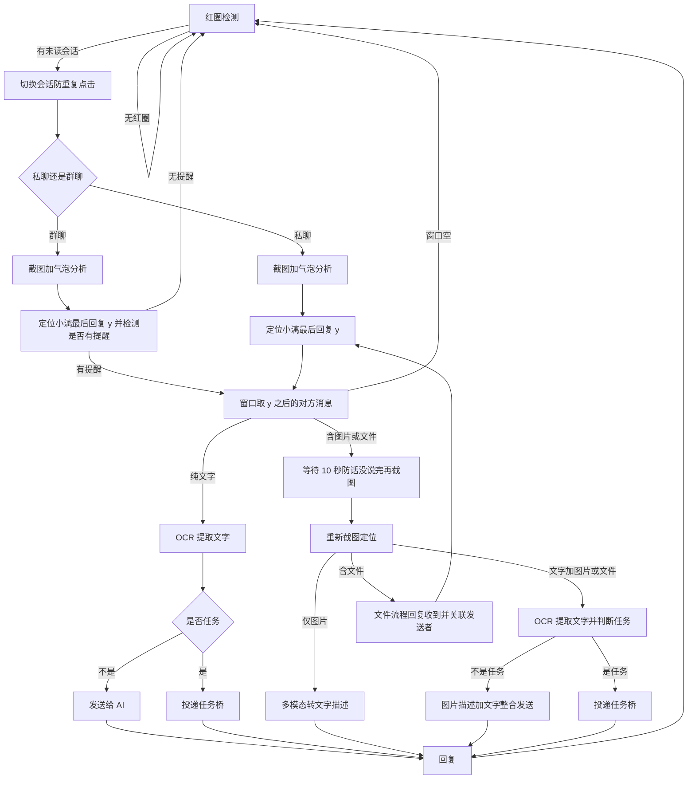

# 小漓更新记录— v2.0.0「视觉版」

> **本次发布版本：v2.0.0「视觉版」**。核心变化：为适配微信 4.1.12+，弃用 wxauto4（UIA 通道），全面迁移到 OCR 视觉方案。
> 基线：GitHub 仓库 `wens6515/weixin-wxauto-ocr-xiaoli`（前 `xiaoli-wechat-ai-bot`）的 `origin/main`（v1.0.1「初漓」，76 个提交）。
> 本文档对比基线之后本地全部增量：**69 个已提交 + 一批未提交工作区改动**，供 v2.0.0 开源发布使用。
> 衔接上一份 `docs/更新记录-2026-08-06.md`（该份内容在 GitHub 上已存在，本文档覆盖其之后的全部改动）。

---

## 更新总览

| 维度 | 基线（GitHub v1.0.1） | 当前（本地） | 变化量 |
|---|---|---|---|
| 提交数 | 76 | 145 | +69 |
| 代码增量 | — | 31 文件 +7125/−786 行（已提交） | — |
| 微信通道 | wxauto4（UIA 控件树） | **视觉方案（PrintWindow 截图 + OCR）唯一后端** | 架构级 |
| `wx_backend` 模块 | **不存在** | 新增 models.py + visual_backend.py + __init__.py（1863 行） | 全新 |
| UI 模块 | 4 文件（无主题系统） | 12 套主题 + 壁纸库 + 毛玻璃 + 仪表盘（8 文件 + SVG 图标） | 全面重写 |
| 测试 | 12 个文件 | 15 个文件（+3 新测试文件，1117/336/99 行） | +36% |
| 工具集 | 无 | 7 个工具脚本 + 安装脚本 + Inno Setup 安装器 | 全新 |
| 文档 | 1 份更新记录 | 3 份更新记录 + 2 份通道调研/结论 | +4 |

**一句话主线：微信 4.1.12 把 UI 渲染切换为「Qt 壳 + Chromium 内容」，UIA 控件树默认关闭，wxauto4 整条通道结构性失效——本次大更新把所有「高效通道」（UIA/CDP/窗口消息/本地数据）逐一验证关闭后，将收发消息全面迁移到 PrintWindow 截图 + 本地 OCR + 像素检测的视觉方案，并对桌面端 UI 做了主题系统级重写。**

---

## 消息处理主循环（v2.0.0 权威架构）

> 以下 flowchart 为 v2.0.0 消息处理权威架构，与 `xiaoli_desktop/xiaoli_bot.py` L969-1157（`process_new_messages` / `_handle_unread_session` / `_handle_file_message` / `_handle_image_with_text`）逐节点核对一致。

> 判据细节：bot 最后回复 y 用「窄列头像」几何判据，无头像则整个消息区域视作对方消息；气泡色/媒体矩形分析无法区分视频、表情、图片消息，统一按图片处理（H/L 节点 sleep 10s 防话没说完）；群聊分支只有 @小漓 的消息才处理（S 节点）；文件消息 sender 关联实现「收到文件 → 回复收到 → 该发送者后续文字指令自动关联待处理文件」（O → E 回路）。

> 说明：气泡色/媒体矩形分析无法区分视频、表情、图片消息，所以统一按图片处理（H/L 节点 sleep 10s 防话没说完）；群聊分支只有 `@小漓` 的消息才处理（S 节点）；文件消息 sender 关联实现「收到文件 → 回复收到 → 该发送者后续文字指令自动关联待处理文件」（O → E 回路）。

---

## 一、核心架构：微信通道 wxauto → 视觉（最大变化）

### 背景与结论
- 微信 4.1.12 渲染层变为 Chromium 内容，`EnumChildWindows` 主窗口**零子窗口**、UIA 树为空壳，wxauto4 无法取控件。
- 探索过的高效通道**全部关闭**（实测证据见 `docs/微信通道验证结论.md`）：
  - `--force-renderer-accessibility` 注入：business_controls 仍为 0（H1 失败）
  - `--remote-debugging-port=9222` 注入：参数进入命令行但无 DevToolsActivePort、端口不监听（H2 失败）
  - 本地消息数据：登录态 `key_info.dat` 加密、消息存加密 mmkv，不可读
  - 唯一可用通道：**PrintWindow 截图 + 视觉识别**
- 登录态保留验证通过（H3）：注入/还原实验不影响微信自动登录。

### 新模块 `xiaoli_desktop/wx_backend/`（全新）
- `models.py`（48 行）：`WeChatMessage` / `BackendError` 等协议模型。
- `visual_backend.py`（1629 行）：视觉后端完整实现，能力清单见下节。
- `__init__.py`（192 行）：后端注册表 + `create_backend("auto")` 自动选择/降级；**wxauto 后端已从注册表移除**（未提交改动），visual 为当前唯一内置后端。
- 业务层（`wechat_bot.py` ±692 行 / `xiaoli_bot.py` ±558 行）只面向后端协议编程，视觉坐标定位集中在 visual_backend 内部，上层无感知。

### visual_backend 能力清单（`wx_backend/visual_backend.py`）
- **截图**：`capture_window` PrintWindow 抗遮挡（被遮挡时 PrintWindow 返回黑图是历史卡死根因，截图前强制置前窗口）。
- **OCR**：RapidOCR 本地引擎（`ocr_image`）+ 分片识别 `ocr_image_sharded`（防长消息截断）。
- **变化检测先行**：`region_changed` 本地像素差异（毫秒级），无变化跳过识别——避免每轮调视觉 API，满足「不想要每轮轮询多模态 AI」的效率诉求。
- **未读检测**：`_detect_red_clusters` 列表区品牌红（#FA5151）像素簇检测 + `iter_unread_sessions` 红圈驱动迭代（只处理有新消息的会话，等效 wxauto4 的"新消息→处理"事件语义）。
- **消息定位**：气泡色检测 + 连通域（`find_bubble_boxes` / `find_media_boxes`）、头像几何不变量（`detect_avatar_tops`，修复深色图片/连续消息误判窗口空）、群聊发送者名识别（气泡上方短文本行）。
- **会话名识别**：整窗 OCR（列表区 crop 读不出会话名，必须整窗）。
- **发送**：`send_text` 中文走剪贴板、`send_file` 剪贴板复制粘贴优先（visual 后端协议 send_file 未实现，恒走剪贴板兜底——`tests/test_send_method.py` 锚定该语义）。
- **窗口管理**：`find_wechat_window` / `find_window_by_title` / `ensure_window_visible`；输入框坐标标定加载（`_load_input_box_calibration`）。

---

## 二、微信消息链路修复（约 50 个提交）

### 新消息检测与读取
- 未读红圈角标驱动新消息检测（替代轮询全量会话）。
- 消息读取通道重构：`[动画表情]` 识别、群聊过滤表情、图片精确点击截图、头像文字排除（63babd5）。
- 单字符消息（如"1"）不再被当作噪声过滤（cdb964d）。
- 输入框"发送"按钮被 OCR 当消息顶掉真实最新消息——latest 改取最后一条非 self 消息（be3ec32）。
- 读到 0 条时强制重切（toggle 兜底重试，ff501e6/e81176d）。

### 定位与窗口语义
- 消息定位改**头像几何不变量**（d3c6f4e），base_h 真机标定 1/12→1/18（c14c59c）。
- 会话切换防重复点击：微信 toggle 会取消选中，`_switch_chat` 标题对比 UI 检测（bbf7308/8f129b3/8b19145）。
- 截图前先置前微信窗口（d388b1c）；点击/输入前强制窗口置前（cb826ae）。
- OCR 区域默认值真机框选标定（53802d6），打包 exe 无配置时不再框进输入框。
- 群聊判定权威信号 = 标题区 OCR + 群聊 @ 过滤（c1bf3a2），标题拼接修复（574c29e）。

### 文件消息与任务桥
- 文件消息文件名 token 拆分——修复 splitext 被"20.1K"小数点误导（822a28b）。
- 成果文件误判对方消息：bot 定位补右对齐气泡判据（13ba50f）。
- 成果副本排除覆盖文件名锚定路径 + 任务回传后刷新快照（e20a3c6）。
- 图片预览窗口按标题匹配 + Win32 矩形（微信 4.1.12 Qt 类名失效，6301539）。
- 任务桥多行气泡归并修复消息截断（85cdb25）。

### 模型与角色
- 模型清单更新为当下最新（deepseek-v4-pro / glm-5.2）+ 检测可用模型自动回填（482579d）。
- 智谱模型补充（glm-4.6v / 免费 glm-4v-flash，578dca6）。
- 小漓默认角色卡改为 **DeepSeek 酱（蓝色大肥鱼）** 设定 + 颜文字风格（26224ae）。
- 首启头像必选（说明区分消息发送者，91f7e5f/813bdb7）。

---

## 三、UI 主题系统全面重写（18 个提交）

| 能力 | 说明 |
|---|---|
| 12 套主题 | `THEMES` 定义（11 套精选 + blue 兼容默认），Tokyo Night 默认置顶；缺失字段合并基础色板防 KeyError |
| 内置壁纸库 | 根目录「壁纸」文件夹 6 张哲风壁纸，运行时扫描（`wallpapers_dir`/`list_wallpapers`）；默认动漫壁纸；打包模式兼容 exe 同级目录 |
| 毛玻璃/透明度 | 卡片不透明度滑块（0~100%）+ 面板独立滑块；QSS 无真高斯模糊，用半透明 rgba 卡片模拟 |
| 字号 | 三档设置 + 内置思源黑体（fonts/NotoSansSC，28ba882 修复字号切换根因） |
| 主题选择器 | 设置页缩略图网格（`render_theme_thumb` 运行时手绘示意卡），点击切换 |
| 首页仪表盘 | 首页仪表盘 + 圆角窗口 + 主题轮廓升级 + 设置两列布局（56cd2fa） |
| 导航 | 垂直排布防截断、SVG 图标（Lucide 风格 6 个）、固定大字号、标题栏最大化 |
| 修复 | 深色系统黑底/黑边、毛玻璃透出、背景层不渲染、aurora 背景、人格设定重叠 |

新增文件：`ui/backdrop.py`（186 行，背景粒子层/壁纸渲染）、`ui/_icons.py`、`ui/assets/icons/*.svg` ×6；`ui/__init__.py` +598、`ui/pages.py` +566、`ui/main_window.py` +364。

---

## 四、工具集（`tools/`，全新）

| 工具 | 作用 |
|---|---|
| `pick_ocr_region.py`（320 行） | OCR 区域图形框选（列表→消息→标题三区域 + 窗口位置），高 DPI 适配，`--read/--clear` |
| `calibrate_input_box.py`（90 行） | 输入框坐标标定 |
| `test_read_messages.py`（59 行） | 消息读取链路调试 |
| `cdp_probe.py`（467 行） | CDP / Accessibility 注入探针（通道验证，check/inject/restore） |
| `fix_window.py`（172 行） | 微信窗口固定（写 `wx_window.json`，visual_backend 启动读取同一配置） |
| `install-node.ps1`（103 行） | Node.js 自动安装（缺失时下载官方 LTS，per-user 静默安装） |
| `小漓.iss`（49 行） | Inno Setup 安装脚本（免管理员，壁纸/fonts 合并复制） |

---

## 五、测试

- 新增 3 个测试文件（GitHub 12 → 本地 15）：
  - `test_visual_backend.py`（1117 行）：视觉后端全覆盖（截图/OCR/红圈/气泡/会话/消息/发送）
  - `test_wx_backend.py`（336 行）：后端协议/注册表/降级
  - `test_send_method.py`（99 行）：回传发送分支锚定（剪贴板优先 + send_file 兜底）
- 既有测试增量：`test_wechat_bot.py` +421、`test_task_attachment.py` +107、`test_ui_smoke.py` +25。

---

## 六、打包与安装

- Inno Setup 安装包脚本 `tools/小漓.iss`：安装时自动检测/安装 Node.js（powershell 调 `install-node.ps1`），完成后自动启动小漓。
- 打包坑已记录：壁纸/fonts 必须合并复制防嵌套（dff540b）。
- 未提交的打包相关资源：`小漓.ico`、`小漓.png`（应用图标）。

---

## 七、行为变化（使用者须知）

1. **微信版本兼容**：不再依赖 wxauto4——新版微信 4.1.12 上可工作；但**不支持旧版微信**（视觉方案按 4.1.12 真机标定）。
2. **首启需要 OCR 区域配置**：首次使用需用 `tools/pick_ocr_region.py` 圈选三区域（列表/消息/标题），或用真机标定默认值（当前 `wx_ocr_region.json` 已含真机标定值）。
3. **窗口位置固定**：建议用 `tools/fix_window.py` 固定微信窗口位置尺寸（视觉坐标依赖窗口位置），配置存 `wx_window.json`。
4. **视觉通道无 UIA 副作用**：不再有 wxauto 实例化导致的窗口 rect 漂移问题。
5. **中文发送走剪贴板**：与旧协议行为一致，无需感知。

---

## 八、遗留事项

- 视觉方案依赖窗口位置/尺寸稳定（OCR 区域按比例 + 窗口矩形），微信窗口被拖动后需重新标定/固定。
- 群聊空内容/群聊名称不含"群"字的启发式局限沿用（is_group_chat 单点判定）。
- 会话名识别必须整窗 OCR（列表区 crop 读不出），识别成本高于旧 UIA 方案。
- 真实微信环境下的完整链路（发图/发文件/任务回传）需本机回归验证。
- `tests/test_config_store.py:296`、`tests/test_setup.py:818` docstring 无效转义 SyntaxWarning（既有，未处理）。

---
