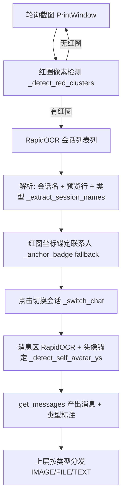

# 交接文档：小漓视觉后端 OCR 方案现状与待 debug 清单

> 本文档给下一个 AI 接续 debug 用。**数据库解密路线已彻底放弃**，当前唯一通道是「PrintWindow 截图 + RapidOCR 视觉识别」。本会话完成 RapidOCR 替换、会话列表类型判定、红圈锚定、启动查重删除、首次启动头像模板上传五件事，均已提交（HEAD=`813bdb7`）、277 项测试全绿、已打包到 `dist\小漓\`。
>
> 微信版本约束（延续，不得违反）：**不降级微信**，必须在 4.1.12.51 上完成。

## 一、当前 OCR 方案架构

核心设计一句话：**类型判定从「消息区 OCR 文本切块」上移到「会话列表预览行」，发送方判定从「气泡 x 坐标」增强为「小漓头像模板匹配」**——把不可靠信号换成可靠信号。

## 二、关键代码位置（file:line，均已核实）

| 位置 | 作用 |
|---|---|
| `xiaoli_desktop\wx_backend\visual_backend.py:165` | `_get_ocr_engine`：RapidOCR 懒加载单例 |
| `xiaoli_desktop\wx_backend\visual_backend.py:199` | `ocr_image`：RapidOCR 版，契约 `(img, max_w=0) -> [{text,x,y,w,h}]` |
| `xiaoli_desktop\wx_backend\visual_backend.py:273` | `_detect_red_clusters`：红圈像素检测（品牌红 #FA5151 阈值） |
| `xiaoli_desktop\wx_backend\visual_backend.py:427` | `_preview_type`：预览行 `[图片]/[视频]/[文件]/[表情]` → MessageType |
| `xiaoli_desktop\wx_backend\visual_backend.py:528` | `_extract_session_names`：会话名 + 预览行 + 类型配对 |
| `xiaoli_desktop\wx_backend\visual_backend.py:621` | `iter_unread_with_type`：红圈 → (会话名, 类型) |
| `xiaoli_desktop\wx_backend\visual_backend.py:675` | `_anchor_badge`：红圈锚定 fallback（会话名 OCR 漏读时点击红圈右下读顶部标题） |
| `xiaoli_desktop\wx_backend\visual_backend.py:720` | `_detect_self_avatar_ys`：头像模板多尺度匹配 |
| `xiaoli_desktop\wx_backend\visual_backend.py:753` | `get_messages`：消息区 OCR + 类型标注 + 头像锚定判 sender |
| `xiaoli_desktop\wx_backend\models.py:13` | `MessageType`：TEXT/IMAGE/FILE/VIDEO/EMOJI/TIME/SYSTEM 七类 |
| `xiaoli_desktop\wechat_bot.py:226` | `avatar_template` 从 cfg 提取 |
| `xiaoli_desktop\wechat_bot.py:327` | `create_backend("auto", avatar_template=...)` 透传 |
| `xiaoli_desktop\xiaoli_gui.py:128` | FirstRunDialog 头像模板上传 UI |
| `xiaoli_desktop\xiaoli_gui.py:157` | `_pick_avatar`：选择头像截图 + 预览 |
| `xiaoli_desktop\xiaoli_app\config_store.py:466` | config 的 `avatar_template` 字段 |

## 三、已验证事实（真机实测，可直接信任）

1. **RapidOCR 识别率碾压 Windows OCR**。同一张整窗截图（1300×1610）：Windows OCR 把「王文生」读成「干立牛」、`[图片]` 读成「隆片]」、`王美晨` 读成「艹王美晨」、`.docx` 读成 `, d ocx`；RapidOCR 同一张图全部读对（会话名置信度 1.00）。噪声随内容漂移是 Windows OCR 的固有缺陷，换引擎是根治。
2. **RapidOCR 可 crop 会话列表列**（546×1610）读对会话名+预览，耗时约 2s（整窗 4s）。旧代码「必须整窗 OCR」是 Windows OCR 的结论，对 RapidOCR 不成立。但当前 `_extract_session_names` 仍传整窗（`ocr_image(shot)`），crop 优化未做。
3. **红圈检测 + 会话名识别 + 类型识别链路已真机跑通**：红圈 1 簇 → `iter_unread_with_type` 返回 `[('王文生', 'image')]`。之前 Windows OCR 时代这里返回空（王文生漏消息），现在修复。
4. **文件消息预览 = `[文件] + 文件名`（同行）**，但文件名被微信 UI 截断（长名显示 `.do..` 省略号），**预览行拿不到完整文件名**。
5. **启动查重已删除**（`_seed_existing_ids` 移除），启动不再遍历所有会话点击+OCR。

## 四、待 debug 清单（下一个 AI 的工作，按优先级）

### P0：头像锚定参数未真机标定

`_detect_self_avatar_ys`（visual_backend.py:720）里的匹配阈值 `0.6` 和尺寸假设「头像高度 ≈ 消息区高度 1/12」（`base_h = max(40, rh // 12)`）是**按常理设的默认值，未真机标定**。用户已上传头像模板（`屏幕截图 2026-08-13 124316.png`，粉色圆形卡通头像），但还没在真实消息区验证匹配效果。

debug 方式：真机截一张「消息区含自己发的消息 + 对方消息」的图，跑 `_detect_self_avatar_ys` 看匹配位置是否对齐自己消息气泡。若自己的消息被判成对方（或反之），调阈值/尺寸假设。若匹配完全失败（ys 为空），检查头像模板尺寸 vs 消息区头像实际尺寸的缩放关系。

### P1：红圈锚定 fallback 未真机走通

`_anchor_badge`（visual_backend.py:675）在「红圈检测到但会话名 OCR 漏读」时触发，点击红圈右下偏移（+45px）读顶部标题。这个分支只有单元测试覆盖，没在真实微信上走通过（因为 RapidOCR 换上去后会话名不再漏读，主路径直接命中了）。需要构造「会话名被遮挡/漏读但红圈在」的场景验证偏移量 `bcx + 45` 是否点得准。

### P2：消息区类型只标注最新一条

`get_messages` 末尾只把 `msgs[-1]`（最新一条）的类型改成 `_session_types[chat]`，更早的消息仍硬编码 TEXT。当前够用（监听只看最新消息），但如果未来要处理历史消息，这里要改成按预览类型逐条标注。见 visual_backend.py 的 `get_messages` 末尾 `if msgs: ... replace(msgs[-1], type=t)`。

### P3：`[视频]`/`[表情]` 类型识别未真机验证

`_preview_type`（visual_backend.py:427）对 `[视频]`/`[表情]` 的映射有单元测试，但真机只验证过 `[图片]`/`[文件]`/文字。且 `MessageType.VIDEO/EMOJI` 识别后上层只打标签不处理（wechat_bot 的类型分发只接 IMAGE/FILE/TEXT）。

### P4：文件消息完整文件名

会话列表预览行文件名是 UI 截断的（`.do..`），完整文件名要靠消息区 OCR 或接收目录 `_find_file_by_display_name` 主干匹配。文件消息的 OCR 噪声（`.docx` → `, d ocx`、数字 `1` → `I`）是确定性的（三轮 OCR 逐字节一致），可以写精确清理规则，但还没做。

## 五、测试 / 打包 / 运行

- **测试**：`D:\AI\小漓\.venv\Scripts\python.exe -m unittest discover -s xiaoli_desktop/tests -p "test_*.py"`（当前 277 项全绿）。单模块如 `... -m unittest xiaoli_desktop.tests.test_visual_backend`。
- **打包**：`cd /d/AI/小漓 && .venv/Scripts/python.exe -m PyInstaller 小漓.spec --noconfirm` → `dist\小漓\`。spec 已配置 `collect_data_files('rapidocr_onnxruntime')`（三个 `.onnx` 模型 + config.yaml 必须打进 `_internal`，否则运行时 RapidOCR 加载失败）。
- **运行**：`dist\小漓\小漓.exe`（GUI）。首次启动走完整引导（选目录 → 上传头像模板可选 → 引导天枢 CLI 配模型 → 首页连微信）。

## 六、环境依赖（根 venv）

- Python 3.12.9，venv `D:\AI\小漓\.venv`
- 新增依赖：`rapidocr-onnxruntime==1.4.4`（连带 onnxruntime、opencv-python、numpy 2.5.2、shapely、pyclipper）
- 已安装 PyInstaller 6.21.0

## 七、不要做的事

- 不要回头走数据库解密路线（已穷尽，见历史 commit `78da54c` 的 Ghidra 逆向记录）
- 不要用 Windows OCR（winsdk）——已确认噪声致命
- 不要降级微信
